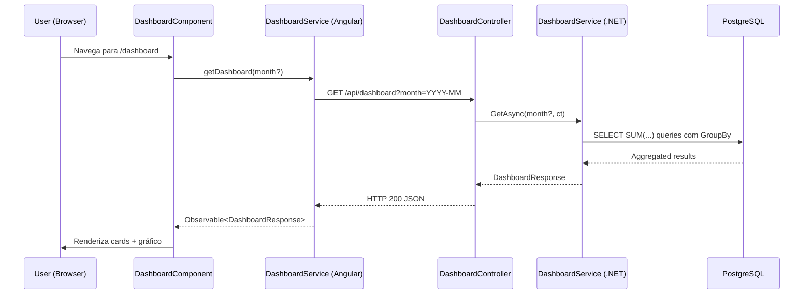
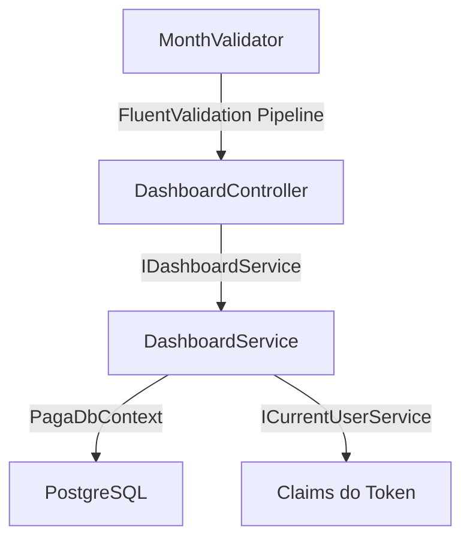
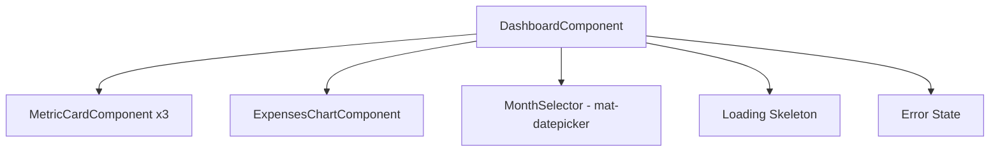

# Design Document — module-dashboard

## Overview

O módulo Dashboard implementa a quarta fatia vertical de negócio do PAGA, cobrindo as Stories
**PP-34** (API) e **PP-74** (Frontend). Ele fornece ao usuário autenticado uma visão consolidada
de sua situação financeira: saldo acumulado, receitas e despesas do mês selecionado, e um gráfico
de despesas agrupadas por tipo.

A feature se decompõe em:

1. **Backend** — Um endpoint `GET /api/dashboard?month=YYYY-MM` que retorna métricas agregadas
   computadas diretamente no banco de dados (sem carregar entidades em memória).
2. **Frontend** — O `DashboardComponent` funcional que substitui o placeholder existente, composto
   por cards de métrica, gráfico de barras horizontal e seletor de mês, com estados de loading,
   vazio e erro.

O design segue rigorosamente os padrões já estabelecidos no codebase: camadas separadas no
backend (Controller → Service interface → Service implementation), standalone components com
OnPush no frontend, e tokens de design via CSS custom properties.

---

## Architecture

### High-Level Data Flow



### Backend Layer Diagram



### Frontend Component Tree



---

## Components and Interfaces

### Backend

#### DTOs (`Paga.Application.DTOs`)

```csharp
// Response principal do dashboard
public record DashboardResponse(
    decimal CurrentBalance,
    decimal MonthlyIncome,
    decimal MonthlyExpense,
    IReadOnlyList<ExpenseByTypeItem> ExpensesByType);

// Item do agrupamento de despesas por tipo
public record ExpenseByTypeItem(
    string TypeName,
    decimal Total);
```

Não há DTO de request — o único parâmetro (`month`) é recebido como query string no controller e
parsed para `DateOnly` (primeiro dia do mês) e `DateOnly` (último dia do mês) no service.

#### Service Interface (`Paga.Application.Abstractions`)

```csharp
/// <summary>
/// Computes aggregated financial metrics for the authenticated user's dashboard.
/// </summary>
public interface IDashboardService
{
    /// <summary>
    /// Returns dashboard metrics for the specified month (or current month if null).
    /// </summary>
    /// <param name="year">Year component of the month to query.</param>
    /// <param name="month">Month component (1-12) to query.</param>
    /// <param name="ct">Cancellation token.</param>
    Task<DashboardResponse> GetAsync(int year, int month, CancellationToken ct = default);
}
```

#### Service Implementation (`Paga.Infrastructure.Services`)

`DashboardService` recebe `PagaDbContext` e `ICurrentUserService` via construtor. Executa
**três queries separadas** no banco, todas com `AsNoTracking()` e filtro `UserId`:

1. **currentBalance** — Duas subqueries: `SUM(Income.Value)` sem filtro de data minus
   `SUM(Expense.Value)` sem filtro de data.
2. **monthlyIncome** — `SUM(Income.Value) WHERE Date >= firstDayOfMonth AND Date <= lastDayOfMonth`.
3. **monthlyExpense + expensesByType** — Uma query com `GroupBy(e => e.ExpenseType.Name)` +
   `Select(g => new { TypeName = g.Key, Total = g.Sum(e => e.Value) })` com filtro de DueDate
   no mês. O total do mês é derivado da soma dos grupos (evita uma query adicional).

Todas as queries são projetadas diretamente para os records de DTO — nenhuma entidade é
materializada em memória.

#### Controller (`Paga.Api.Controllers`)

```csharp
[ApiController]
[Route("api/dashboard")]
[Authorize]
public class DashboardController : ControllerBase
{
    private readonly IDashboardService _dashboardService;

    public DashboardController(IDashboardService dashboardService)
    {
        _dashboardService = dashboardService;
    }

    /// <summary>
    /// Returns financial metrics for the authenticated user.
    /// </summary>
    [HttpGet]
    [ProducesResponseType(typeof(DashboardResponse), StatusCodes.Status200OK)]
    [ProducesResponseType(StatusCodes.Status400BadRequest)]
    public async Task<IActionResult> Get([FromQuery] string? month, CancellationToken ct)
    {
        // Parse and validate month (or default to current)
        var (year, monthNum) = ParseMonth(month);
        var result = await _dashboardService.GetAsync(year, monthNum, ct);
        return Ok(result);
    }
}
```

**Validação do parâmetro `month`:**
- Se `null`/vazio → usa `DateTime.UtcNow` (ano e mês corrente).
- Se informado → regex `^\d{4}-(0[1-9]|1[0-2])$` no controller. Se inválido → retorna 400
  ProblemDetails com mensagem pt-BR: `"O parâmetro 'month' deve estar no formato YYYY-MM com mês entre 01 e 12."`.

A validação é feita inline no controller (método privado `ParseMonth`) ao invés de FluentValidation,
pois não há DTO de body — é apenas um query param simples. Este padrão é consistente com
controllers que validam query params diretamente.

#### DI Registration

No `Program.cs`, adicionar:
```csharp
builder.Services.AddScoped<IDashboardService, DashboardService>();
```

---

### Frontend

#### Model (`dashboard.model.ts`)

```typescript
export interface DashboardResponse {
  currentBalance: number;
  monthlyIncome: number;
  monthlyExpense: number;
  expensesByType: ExpenseByType[];
}

export interface ExpenseByType {
  typeName: string;
  total: number;
}
```

#### Service (`dashboard.service.ts`)

```typescript
@Injectable({ providedIn: 'root' })
export class DashboardService {
  private readonly http = inject(HttpClient);
  private readonly apiUrl = environment.apiUrl;

  getDashboard(month?: string): Observable<DashboardResponse> {
    let params = new HttpParams();
    if (month) {
      params = params.set('month', month);
    }
    return this.http.get<DashboardResponse>(`${this.apiUrl}/dashboard`, { params });
  }
}
```

#### DashboardComponent (substitui placeholder)

Estado interno gerido por signals:

```typescript
// Signals
loading = signal(true);
error = signal(false);
data = signal<DashboardResponse | null>(null);
selectedMonth = signal<string>(currentMonthYYYYMM());
```

Fluxo:
1. `ngOnInit` / `effect` observa `selectedMonth` e dispara `loadData()`.
2. `loadData()` seta `loading(true)`, `error(false)`, chama `DashboardService.getDashboard(month)`.
3. Sucesso → `data.set(response)`, `loading.set(false)`.
4. Erro → `error.set(true)`, `loading.set(false)`.
5. Retry → `loadData()` com o mesmo mês.

Template usa `@if (loading())` para skeleton, `@if (error())` para estado de erro, e
`@if (data())` para conteúdo.

#### MetricCardComponent (`shared/metric-card/`)

Componente reutilizável:

```typescript
@Component({
  selector: 'app-metric-card',
  standalone: true,
  changeDetection: ChangeDetectionStrategy.OnPush,
  templateUrl: './metric-card.component.html',
  styleUrl: './metric-card.component.scss'
})
export class MetricCardComponent {
  title = input.required<string>();
  value = input.required<number>();
  valueColor = input.required<string>();
  subtitle = input<string>();
}
```

Formata internamente com `CurrencyPipe` (BRL). Aplica `[style.color]` com a cor recebida.
Card com fundo `var(--bg-primary)`, borda `var(--border)`, `border-radius: 12px`,
`padding: var(--spacing-lg)`.

#### ExpensesChartComponent (`features/dashboard/expenses-chart/`)

Wrapper para o ngx-charts horizontal bar chart:

- Recebe `expensesByType` e `monthLabel` como inputs.
- Transforma dados para o formato esperado pelo ngx-charts: `{ name, value }[]`.
- Formatação dos valores nas barras em BRL via `valueFormatting` function do ngx-charts.
- Esquema de cores: custom color scheme com tons de azul.
- Responsivo: `[view]` calculado pelo container.

#### Month Selector

Utiliza `mat-datepicker` do Angular Material em modo `month` (datepicker com `startView="multi-year"`
e `(monthSelected)` event) ou alternativamente um `<select>` com os últimos 12 meses.

Decisão: usar **`mat-datepicker`** configurado para seleção de mês:
- `startView="multi-year"` com `panelClass` para estilização.
- Evento `(monthSelected)="onMonthSelected($event)"` fecha o picker e atualiza `selectedMonth`.
- Display formatado em português: "Janeiro 2025".

---

## Data Models

### Database Queries (EF Core LINQ)

#### Query 1: Current Balance (All-Time)

```csharp
var totalIncome = await _context.Incomes
    .AsNoTracking()
    .Where(i => i.UserId == userId)
    .SumAsync(i => (decimal?)i.Value, ct) ?? 0m;

var totalExpense = await _context.Expenses
    .AsNoTracking()
    .Where(e => e.UserId == userId)
    .SumAsync(e => (decimal?)e.Value, ct) ?? 0m;

var currentBalance = totalIncome - totalExpense;
```

O cast para `decimal?` evita exceção quando a tabela está vazia (`SumAsync` retorna `null`
para coleção vazia de nullable).

#### Query 2: Monthly Income

```csharp
var monthlyIncome = await _context.Incomes
    .AsNoTracking()
    .Where(i => i.UserId == userId && i.Date >= firstDay && i.Date <= lastDay)
    .SumAsync(i => (decimal?)i.Value, ct) ?? 0m;
```

#### Query 3: Expenses by Type (monthly + grouped)

```csharp
var expensesByType = await _context.Expenses
    .AsNoTracking()
    .Where(e => e.UserId == userId && e.DueDate >= firstDay && e.DueDate <= lastDay)
    .GroupBy(e => e.ExpenseType.Name)
    .Select(g => new ExpenseByTypeItem(g.Key, g.Sum(e => e.Value)))
    .ToListAsync(ct);

var monthlyExpense = expensesByType.Sum(x => x.Total);
```

Aqui `monthlyExpense` é derivado da soma dos grupos, economizando uma query separada. O
`GroupBy` com navegação por `e.ExpenseType.Name` é resolvido pelo EF Core como JOIN + GROUP BY.

### Date Boundaries

```csharp
var firstDay = new DateOnly(year, month, 1);
var lastDay = firstDay.AddMonths(1).AddDays(-1);
```

### JSON Response Shape

```json
{
  "currentBalance": 12500.75,
  "monthlyIncome": 8000.00,
  "monthlyExpense": 3200.50,
  "expensesByType": [
    { "typeName": "Alimentação", "total": 1500.00 },
    { "typeName": "Transporte", "total": 800.50 },
    { "typeName": "Lazer", "total": 900.00 }
  ]
}
```

Segue as convenções do contrato: camelCase, decimal numérico, sem userId no response.

---

## Correctness Properties

*A property is a characteristic or behavior that should hold true across all valid executions of a
system — essentially, a formal statement about what the system should do. Properties serve as the
bridge between human-readable specifications and machine-verifiable correctness guarantees.*

### Property 1: Balance invariant (all-time)

*For any* user with any set of incomes (values $i_1, i_2, ..., i_n$) and expenses (values
$e_1, e_2, ..., e_m$), the `currentBalance` returned by the dashboard service SHALL equal
$\sum i_k - \sum e_j$, regardless of the month queried.

**Validates: Requirements 1.3, 1.8**

### Property 2: Monthly income filtering correctness

*For any* user with any set of incomes distributed across multiple months, and *for any* valid
month `YYYY-MM`, the `monthlyIncome` returned SHALL equal the sum of `Value` for incomes whose
`Date` falls within the first and last day (inclusive) of that month.

**Validates: Requirements 1.4, 1.2**

### Property 3: Monthly expense filtering correctness

*For any* user with any set of expenses distributed across multiple months, and *for any* valid
month `YYYY-MM`, the `monthlyExpense` returned SHALL equal the sum of `Value` for expenses whose
`DueDate` falls within the first and last day (inclusive) of that month.

**Validates: Requirements 1.5, 1.2**

### Property 4: ExpensesByType grouping integrity

*For any* user with expenses in a given month, *for each* expense type that has at least one
expense in the month, there SHALL exist exactly one entry in `expensesByType` with `typeName`
matching the type name and `total` equaling the sum of all expenses of that type within the month.
Additionally, the sum of all `total` values in `expensesByType` SHALL equal `monthlyExpense`.

**Validates: Requirements 1.6, 1.7**

### Property 5: Invalid month rejection

*For any* string that does NOT conform to the pattern `YYYY-MM` with month in range `01–12`
(including empty strings, arbitrary text, valid format but out-of-range month like `2024-13`,
partial matches like `2024-1`), the API SHALL respond with HTTP 400.

**Validates: Requirements 2.1, 2.2**

### Property 6: Multi-tenant isolation

*For any* two distinct users A and B, each with their own set of incomes and expenses, user A's
dashboard response SHALL be computed exclusively from user A's data. Specifically: user A's
`currentBalance`, `monthlyIncome`, `monthlyExpense`, and each item in `expensesByType` SHALL be
unaffected by the existence, creation, or deletion of user B's data.

**Validates: Requirements 3.1, 3.2, 3.3**

---

## Error Handling

### Backend

| Cenário | Resposta | Mecanismo |
|---------|----------|-----------|
| Token ausente/inválido | 401 | `[Authorize]` attribute + middleware JWT |
| `month` formato inválido | 400 ProblemDetails | Validação no controller (`ParseMonth`) |
| `month` mês fora de 01-12 | 400 ProblemDetails | Validação no controller |
| Erro inesperado no service | 500 ProblemDetails (mensagem genérica) | Exception handler global |

Mensagem de validação do month em pt-BR:
`"O parâmetro 'month' deve estar no formato YYYY-MM com mês entre 01 e 12."`

Não há cenário 404 (o dashboard sempre retorna dados — zerados quando sem lançamentos).
Não há cenário 409 (nenhuma mutação de dados).

### Frontend

| Cenário | Comportamento |
|---------|---------------|
| Loading | Skeleton com shimmer nos cards e área do gráfico |
| Sucesso sem dados no mês | Cards com R$ 0,00, gráfico mostra empty state |
| Erro HTTP 500 / timeout | Mensagem "Erro ao carregar dados" + botão "Tentar Novamente" |
| Erro HTTP 401 | Interceptor redireciona para `/login` (já existente) |
| Erro HTTP 400 (month inválido) | Não deve ocorrer — seletor de mês só emite valores válidos |

O retry re-executa a mesma request com o `selectedMonth` atual.

---

## Testing Strategy

### Backend — Testes Unitários (`Unit/DashboardServiceTests.cs`)

Testam o `DashboardService` com `DbContext` in-memory ou mock, validando:

| Cenário | Verifica |
|---------|----------|
| Sem dados (usuário vazio) | Retorna zeros e array vazio |
| Receitas e despesas no mês | Cálculos corretos de monthlyIncome e monthlyExpense |
| Mês específico (não corrente) | Filtra corretamente por boundaries do mês |
| Múltiplos tipos de despesa | Agrupamento correto em expensesByType |
| Saldo negativo | Despesas > receitas resulta em currentBalance negativo |
| Receitas em meses diferentes | Apenas o mês consultado contribui para monthlyIncome |
| Isolamento | Dados de outro userId não afetam resultado |

### Backend — Testes de Integração (`Integration/DashboardEndpointTests.cs`)

Executam contra container PostgreSQL efêmero (Testcontainers):

| Cenário | Verifica |
|---------|----------|
| `GET /api/dashboard` → 200 | Shape correto no response |
| `GET /api/dashboard?month=2024-03` | Dados filtrados para março 2024 |
| `GET /api/dashboard?month=invalid` → 400 | Validação do parâmetro |
| Sem token → 401 | Proteção de autenticação |
| Isolamento entre usuários | Dados de A não aparecem no dashboard de B |
| Mês sem dados → zeros | monthlyIncome/monthlyExpense = 0, expensesByType = [] |

### Backend — Testes de Propriedade (PBT)

Biblioteca: **FsCheck.Xunit** (integração com xUnit).

Cada property test gera dados aleatórios (incomes/expenses com valores e datas variados) e
verifica as invariantes. Mínimo 100 iterações por property.

| Property | Tag |
|----------|-----|
| Balance invariant | Feature: module-dashboard, Property 1: Balance equals sum of all incomes minus sum of all expenses |
| Monthly income filtering | Feature: module-dashboard, Property 2: Monthly income equals sum of incomes in month |
| Monthly expense filtering | Feature: module-dashboard, Property 3: Monthly expense equals sum of expenses in month |
| ExpensesByType grouping | Feature: module-dashboard, Property 4: Group totals equal per-type sums and overall total |
| Invalid month rejection | Feature: module-dashboard, Property 5: Invalid month strings produce 400 |
| Multi-tenant isolation | Feature: module-dashboard, Property 6: User data is isolated |

Os property tests do backend testam o **service layer** diretamente (com DbContext real via
Testcontainers), gerando conjuntos aleatórios de `Income` e `Expense` entities e verificando
as invariantes matemáticas. Property 5 (invalid month) testa a camada do controller com
strings geradas aleatoriamente.

### Frontend — Testes Unitários

| Componente/Service | Cenários |
|--------------------|----------|
| `DashboardService` | Chamada HTTP correta (URL, método, query param `month`) |
| `DashboardComponent` | Exibição dos 3 cards, skeleton durante loading, estado de erro com retry, renderização do gráfico com dados, estado vazio |
| `MetricCardComponent` | Título, valor formatado BRL, cor aplicada, subtítulo opcional |
| `ExpensesChartComponent` | Renderização com dados mockados, ausência quando array vazio |
| Troca de mês | Nova requisição disparada, dados atualizados |

Executados via `ng test --watch=false` com Karma/Jasmine. Usam `HttpTestingController` para
services e `ComponentFixture` para componentes.

---

## File Structure

```
backend/
├── src/Paga.Application/
│   ├── Abstractions/IDashboardService.cs
│   └── DTOs/
│       ├── DashboardResponse.cs
│       └── ExpenseByTypeItem.cs
├── src/Paga.Infrastructure/Services/DashboardService.cs
├── src/Paga.Api/Controllers/DashboardController.cs
└── tests/Paga.Tests/
    ├── Unit/DashboardServiceTests.cs
    └── Integration/DashboardEndpointTests.cs

frontend/src/app/
├── features/dashboard/
│   ├── dashboard.model.ts
│   ├── dashboard.service.ts
│   ├── dashboard.service.spec.ts
│   ├── dashboard.component.ts
│   ├── dashboard.component.html
│   ├── dashboard.component.scss
│   ├── dashboard.component.spec.ts
│   └── expenses-chart/
│       ├── expenses-chart.component.ts
│       ├── expenses-chart.component.html
│       ├── expenses-chart.component.scss
│       └── expenses-chart.component.spec.ts
└── shared/metric-card/
    ├── metric-card.component.ts
    ├── metric-card.component.html
    ├── metric-card.component.scss
    └── metric-card.component.spec.ts
```
