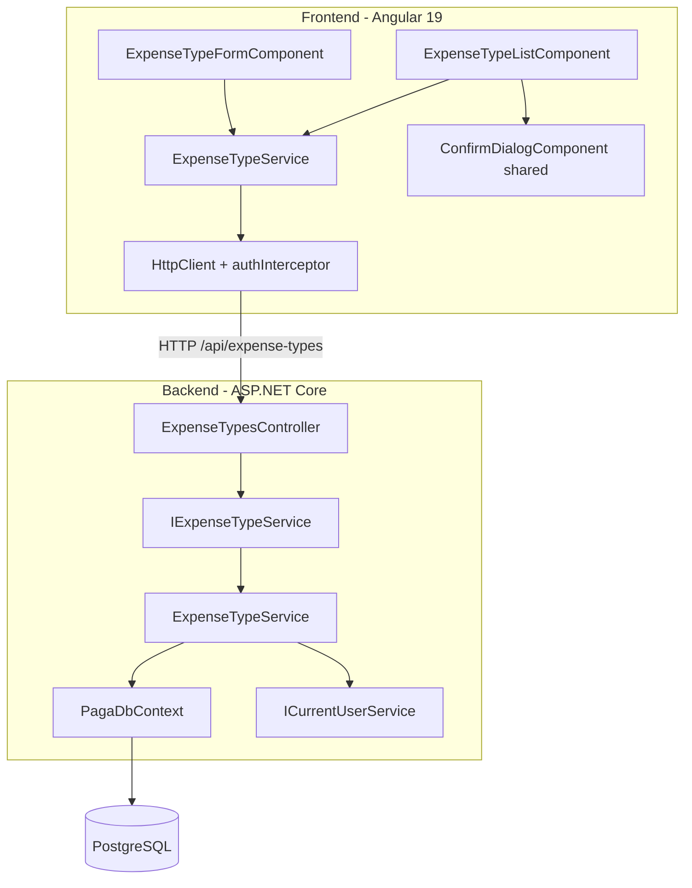
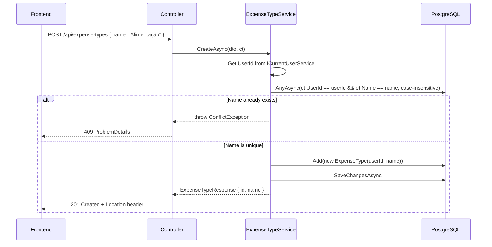

# Design Document — module-expense-types

## Overview

This design covers the full vertical slice for Expense Types: a RESTful CRUD API (backend) and
the Angular SPA feature module (frontend) that consumes it. The module manages user-scoped expense
categories — a prerequisite for the Expenses module that follows.

The domain entity `ExpenseType` (Id int, UserId Guid, Name string max 100) already exists with
its EF Core configuration, unique index `(UserId, Name)`, and the FK from `Expense → ExpenseType`
configured with `DeleteBehavior.Restrict`. No new migration is needed.

### Key Design Decisions

| Decision | Rationale |
|----------|-----------|
| Reuse existing `PagedResult<T>` + `ToPagedResultAsync` | Established pattern from Users module; avoids duplication |
| Single `ExpenseTypeFormComponent` for create/edit | Route param `:id` distinguishes mode; reduces code surface |
| Name uniqueness check in service layer | Case-insensitive query before insert/update; throws `ConflictException` for 409 |
| Delete protection in service layer | `Expenses.AnyAsync(e => e.ExpenseTypeId == id)` before delete; throws `ConflictException` for 409 |
| Reuse `ConfirmDialogComponent` from `shared/` | Already implemented for Users module with `ConfirmDialogData` interface |
| Multi-tenant via `ICurrentUserService` | Consistent with Users module; all queries filter by `UserId` from JWT claims |

## Architecture



### Layer Responsibility

| Layer | Component | Responsibility |
|-------|-----------|----------------|
| Api | `ExpenseTypesController` | Map HTTP verbs to service calls, return status codes |
| Application | `IExpenseTypeService` / `ExpenseTypeService` | Business logic: CRUD, uniqueness check, delete protection, pagination |
| Application | DTOs + Validators | Shape input/output, validate with FluentValidation |
| Domain | `ExpenseType` entity | Enforce invariants via constructor |
| Infrastructure | `ExpenseTypeConfiguration` | EF Core mapping (already exists) |
| Frontend | `ExpenseTypeService` | HTTP calls to API, typed observables |
| Frontend | `ExpenseTypeListComponent` | Table, search, pagination, loading/empty/error states |
| Frontend | `ExpenseTypeFormComponent` | Reactive form, create/edit mode, submit handling |

## Components and Interfaces

### Backend

#### DTOs (Paga.Application/DTOs)

```csharp
// Input for creating an expense type
public record CreateExpenseTypeRequest(string Name);

// Input for updating an expense type
public record UpdateExpenseTypeRequest(string Name);

// Output returned by all expense type endpoints
public record ExpenseTypeResponse(int Id, string Name);

// Query parameters for listing expense types
public record ExpenseTypeFilter(string? Name, int PageNumber = 1, int PageSize = 10);
```

#### Validators (Paga.Application/Validators)

```csharp
public class CreateExpenseTypeRequestValidator : AbstractValidator<CreateExpenseTypeRequest>
{
    public CreateExpenseTypeRequestValidator()
    {
        RuleFor(x => x.Name)
            .NotEmpty().WithMessage("O nome é obrigatório.")
            .MaximumLength(100).WithMessage("O nome deve ter no máximo 100 caracteres.");
    }
}

public class UpdateExpenseTypeRequestValidator : AbstractValidator<UpdateExpenseTypeRequest>
{
    public UpdateExpenseTypeRequestValidator()
    {
        RuleFor(x => x.Name)
            .NotEmpty().WithMessage("O nome é obrigatório.")
            .MaximumLength(100).WithMessage("O nome deve ter no máximo 100 caracteres.");
    }
}
```

#### Service Interface (Paga.Application/Abstractions)

```csharp
public interface IExpenseTypeService
{
    Task<PagedResult<ExpenseTypeResponse>> GetAllAsync(ExpenseTypeFilter filter, CancellationToken ct = default);
    Task<ExpenseTypeResponse> GetByIdAsync(int id, CancellationToken ct = default);
    Task<ExpenseTypeResponse> CreateAsync(CreateExpenseTypeRequest dto, CancellationToken ct = default);
    Task<ExpenseTypeResponse> UpdateAsync(int id, UpdateExpenseTypeRequest dto, CancellationToken ct = default);
    Task DeleteAsync(int id, CancellationToken ct = default);
}
```

#### Service Implementation (Paga.Infrastructure or Paga.Application — follows same pattern as UserService)

Key behaviors:
- `GetAllAsync`: filters by `UserId`, optional case-insensitive `Name` contains, `AsNoTracking`, projects to DTO with `Select`, applies `ToPagedResultAsync`.
- `GetByIdAsync`: queries by `Id` AND `UserId`; throws `NotFoundException` if not found.
- `CreateAsync`: derives `UserId` from `ICurrentUserService`; checks case-insensitive name uniqueness for same user; throws `ConflictException("Já existe um tipo de despesa com este nome.")` on duplicate; creates entity and returns DTO.
- `UpdateAsync`: loads by `Id` AND `UserId`; throws `NotFoundException` if missing; checks uniqueness excluding current record; throws `ConflictException` on duplicate; updates name and saves.
- `DeleteAsync`: loads by `Id` AND `UserId`; throws `NotFoundException` if missing; checks `_context.Expenses.AnyAsync(e => e.ExpenseTypeId == id)`; throws `ConflictException("Não é possível excluir um tipo de despesa que possui despesas vinculadas.")` if linked; removes entity.

#### Controller (Paga.Api/Controllers)

```csharp
[ApiController]
[Route("api/expense-types")]
[Authorize]
public class ExpenseTypesController : ControllerBase
{
    // GET    /api/expense-types?name=&pageNumber=1&pageSize=10  → 200 PagedResult<ExpenseTypeResponse>
    // GET    /api/expense-types/{id}                            → 200 ExpenseTypeResponse | 404
    // POST   /api/expense-types { name }                       → 201 ExpenseTypeResponse (Location header)
    // PUT    /api/expense-types/{id} { name }                  → 200 ExpenseTypeResponse | 404 | 409
    // DELETE /api/expense-types/{id}                            → 204 | 404 | 409
}
```

The controller follows the exact same pattern as `UsersController`: thin, no business logic, delegates to service, maps results to HTTP status codes. `CreatedAtAction` for POST, `NoContent` for DELETE.

### Frontend

#### Model (features/expense-types/expense-type.model.ts)

```typescript
export interface ExpenseType {
  id: number;
  name: string;
}

export interface CreateExpenseTypeRequest {
  name: string;
}

export interface UpdateExpenseTypeRequest {
  name: string;
}

export interface ExpenseTypeListParams {
  name?: string;
  pageNumber: number;
  pageSize: number;
}
```

#### Service (features/expense-types/expense-type.service.ts)

```typescript
@Injectable({ providedIn: 'root' })
export class ExpenseTypeService {
  private readonly http = inject(HttpClient);
  private readonly apiUrl = environment.apiUrl;

  getExpenseTypes(params: ExpenseTypeListParams): Observable<PaginatedResponse<ExpenseType>> { ... }
  getExpenseType(id: number): Observable<ExpenseType> { ... }
  createExpenseType(data: CreateExpenseTypeRequest): Observable<ExpenseType> { ... }
  updateExpenseType(id: number, data: UpdateExpenseTypeRequest): Observable<ExpenseType> { ... }
  deleteExpenseType(id: number): Observable<void> { ... }
}
```

#### Routes (features/expense-types/expense-types.routes.ts)

```typescript
export const EXPENSE_TYPES_ROUTES: Routes = [
  { path: '',        loadComponent: () => import('./expense-type-list/...').then(m => m.ExpenseTypeListComponent) },
  { path: 'new',    loadComponent: () => import('./expense-type-form/...').then(m => m.ExpenseTypeFormComponent) },
  { path: ':id/edit', loadComponent: () => import('./expense-type-form/...').then(m => m.ExpenseTypeFormComponent) },
];
```

#### ExpenseTypeListComponent

- Signals: `expenseTypes`, `totalCount`, `totalPages`, `isLoading`, `error`, `pageNumber`, `pageSize`
- `FormControl` for search with `debounceTime(300)` + `distinctUntilChanged`
- Table columns: `id`, `name`, `actions` (edit + delete buttons)
- States: loading skeleton, empty state ("Nenhum registro encontrado"), error state with "Tentar Novamente"
- Delete: opens `ConfirmDialogComponent` → on confirm calls `deleteExpenseType` → snackbar feedback → reload

#### ExpenseTypeFormComponent

- Mode derived from route: `create` (no `:id`) vs `edit` (has `:id`)
- Reactive form with `name` control (required validator)
- On init (edit mode): loads expense type via `getExpenseType(id)` → populates form; 404 navigates back with error snackbar
- Save: disables button during submission; on success → snackbar + navigate to list; on 409 → shows API error message in snackbar
- Cancel: navigates back without request

## Data Models

### Database (existing — no changes needed)

```
Table: expense_types
├── id          int         IDENTITY, PK
├── user_id     uuid        FK → users(id) CASCADE, NOT NULL
└── name        varchar(100) NOT NULL

Unique Index: IX_expense_types_user_id_name (user_id, name)
```

### Entity (existing — no changes needed)

```csharp
public class ExpenseType
{
    public int Id { get; private set; }
    public Guid UserId { get; private set; }
    public string Name { get; private set; }
    public ExpenseType(Guid userId, string name) { ... }
}
```

### Request/Response Flow



```mermaid
sequenceDiagram
    participant FE as Frontend
    participant API as Controller
    participant SVC as ExpenseTypeService
    participant DB as PostgreSQL

    FE->>API: DELETE /api/expense-types/5
    API->>SVC: DeleteAsync(5, ct)
    SVC->>SVC: Get UserId from ICurrentUserService
    SVC->>DB: Find expense_type WHERE id=5 AND user_id=currentUser
    alt Not found or different user
        SVC-->>API: throw NotFoundException
        API-->>FE: 404
    else Found
        SVC->>DB: AnyAsync(expenses WHERE expense_type_id=5)
        alt Has linked expenses
            SVC-->>API: throw ConflictException
            API-->>FE: 409 ProblemDetails
        else No linked expenses
            SVC->>DB: Remove(entity); SaveChangesAsync
            SVC-->>API: (void)
            API-->>FE: 204 No Content
        end
    end
```

## Error Handling

| Scenario | Layer | Mechanism | HTTP Status |
|----------|-------|-----------|-------------|
| Missing/empty name | Validator (pipeline) | FluentValidation → ProblemDetails | 400 |
| Name exceeds 100 chars | Validator (pipeline) | FluentValidation → ProblemDetails | 400 |
| No/invalid JWT token | Auth middleware | ASP.NET `[Authorize]` | 401 |
| ID not found or belongs to other user | Service | `throw new NotFoundException(...)` | 404 |
| Duplicate name for same user | Service | `throw new ConflictException("Já existe um tipo de despesa com este nome.")` | 409 |
| Delete with linked expenses | Service | `throw new ConflictException("Não é possível excluir um tipo de despesa que possui despesas vinculadas.")` | 409 |
| Unexpected error | Global handler | Generic message, details in Serilog | 500 |

### Frontend Error Handling

| API Status | Frontend Behavior |
|------------|-------------------|
| 200/201/204 | Success snackbar + navigate to list |
| 400 | Display validation errors from ProblemDetails in snackbar |
| 401 | Interceptor handles: refresh attempt → if fails, redirect to login |
| 404 (edit form load) | Navigate back to list + error snackbar |
| 409 | Display conflict message from API response in snackbar |
| 500 | Generic error snackbar "Erro ao processar a solicitação" |
| Network error | Error state with "Tentar Novamente" button (list) or snackbar (form) |

## Testing Strategy

### Why Property-Based Testing Does NOT Apply

This module is a straightforward CRUD with deterministic business rules:
- Name uniqueness is a simple yes/no check against the database
- Delete protection is a simple existence check
- Multi-tenant isolation is a filter clause

There are no pure transformations, no parsing/serialization round-trips, no algorithms where
input variation reveals edge cases across a large input space. The behavior is fully covered by
**example-based unit tests** and **integration tests**.

### Backend Tests (xUnit)

#### Unit Tests (Paga.Tests/Unit/ExpenseTypes/)

**ExpenseTypeServiceTests:**
- `GetAllAsync_ShouldReturnOnlyCurrentUserTypes` — verifies multi-tenant filtering
- `GetByIdAsync_ShouldReturnExpenseType_WhenExistsForCurrentUser`
- `GetByIdAsync_ShouldThrowNotFound_WhenIdDoesNotExist`
- `GetByIdAsync_ShouldThrowNotFound_WhenBelongsToOtherUser`
- `CreateAsync_ShouldCreateAndReturnDto_WhenNameIsUnique`
- `CreateAsync_ShouldThrowConflict_WhenNameAlreadyExistsForUser`
- `UpdateAsync_ShouldUpdateAndReturnDto_WhenValid`
- `UpdateAsync_ShouldThrowNotFound_WhenIdDoesNotExist`
- `UpdateAsync_ShouldThrowConflict_WhenNewNameAlreadyExistsForUser`
- `DeleteAsync_ShouldDeleteSuccessfully_WhenNoLinkedExpenses`
- `DeleteAsync_ShouldThrowNotFound_WhenIdDoesNotExist`
- `DeleteAsync_ShouldThrowConflict_WhenExpensesExist`

**Validator Tests:**
- `CreateExpenseTypeRequestValidator_ShouldFail_WhenNameEmpty`
- `CreateExpenseTypeRequestValidator_ShouldPass_WhenNameValid`
- `UpdateExpenseTypeRequestValidator_ShouldFail_WhenNameEmpty`
- `UpdateExpenseTypeRequestValidator_ShouldPass_WhenNameValid`

#### Integration Tests (Paga.Tests/Integration/ExpenseTypes/)

Using `WebApplicationFactory` + Testcontainers PostgreSQL:

- `POST /api/expense-types` → 201 with valid payload
- `POST /api/expense-types` → 409 with duplicate name for same user
- `POST /api/expense-types` → 201 with same name for different user (isolation)
- `GET /api/expense-types` → 200 with paginated results, only current user's types
- `GET /api/expense-types?name=ali` → 200 filtered results
- `GET /api/expense-types/{id}` → 200 for own type
- `GET /api/expense-types/{id}` → 404 for other user's type
- `GET /api/expense-types/{id}` → 404 for non-existent id
- `PUT /api/expense-types/{id}` → 200 with updated name
- `PUT /api/expense-types/{id}` → 409 with duplicate name
- `PUT /api/expense-types/{id}` → 404 for other user's type
- `DELETE /api/expense-types/{id}` → 204 when no linked expenses
- `DELETE /api/expense-types/{id}` → 409 when expenses exist (insert expense directly via DbContext)
- `DELETE /api/expense-types/{id}` → 404 for other user's type
- Requests without token → 401

### Frontend Tests (Karma/Jasmine)

**ExpenseTypeService (expense-type.service.spec.ts):**
- Correct HTTP method, URL and params for each operation
- Query params correctly serialized for list with filters

**ExpenseTypeListComponent (expense-type-list.component.spec.ts):**
- Renders table with data from service
- Search triggers API call with 300ms debounce
- Displays loading skeleton during fetch
- Displays empty state when no results
- Displays error state with retry button on failure
- Edit button navigates to `:id/edit`
- Delete opens confirm dialog; on confirm calls API and shows snackbar

**ExpenseTypeFormComponent (expense-type-form.component.spec.ts):**
- Create mode: shows "Novo Tipo de Despesa" title, empty form
- Edit mode: loads data, shows "Editar Tipo de Despesa" title, pre-fills form
- Edit mode: navigates back with error snackbar on 404
- Validates name required (submit button disabled when invalid)
- Submit calls correct API method (POST for create, PUT for edit)
- Disables save button during submission
- Shows success snackbar and navigates on success
- Shows API error message on 409
- Cancel navigates back without API call

**ConfirmDialogComponent (already has tests from Users module — verify coverage):**
- Displays dynamic title and message
- Emits true on confirm
- Closes without value on cancel
