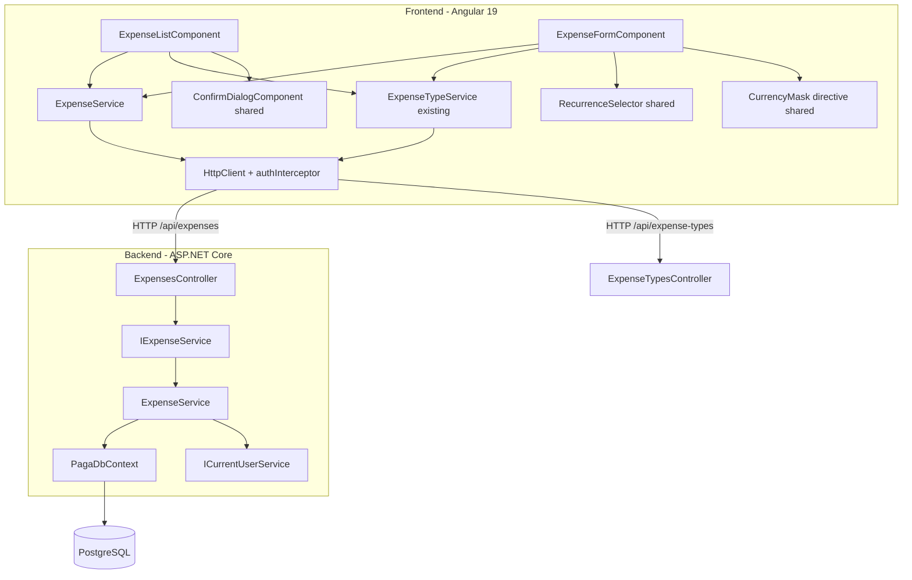
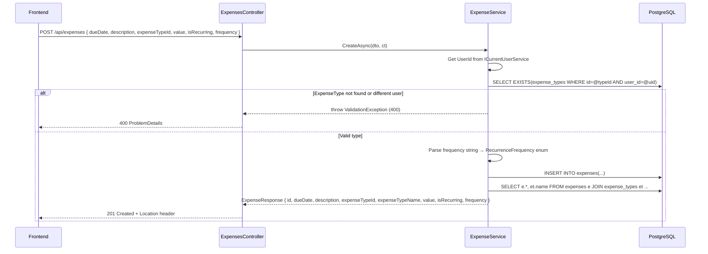
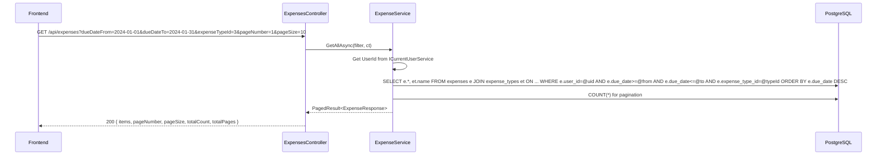
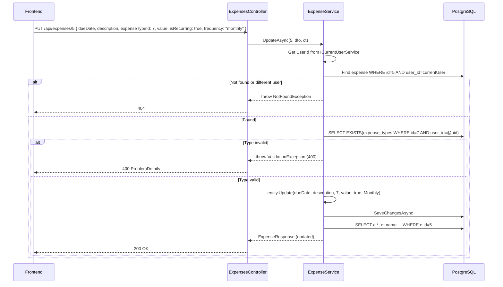
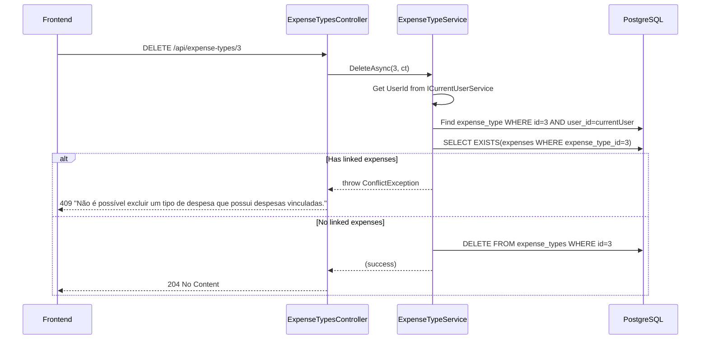
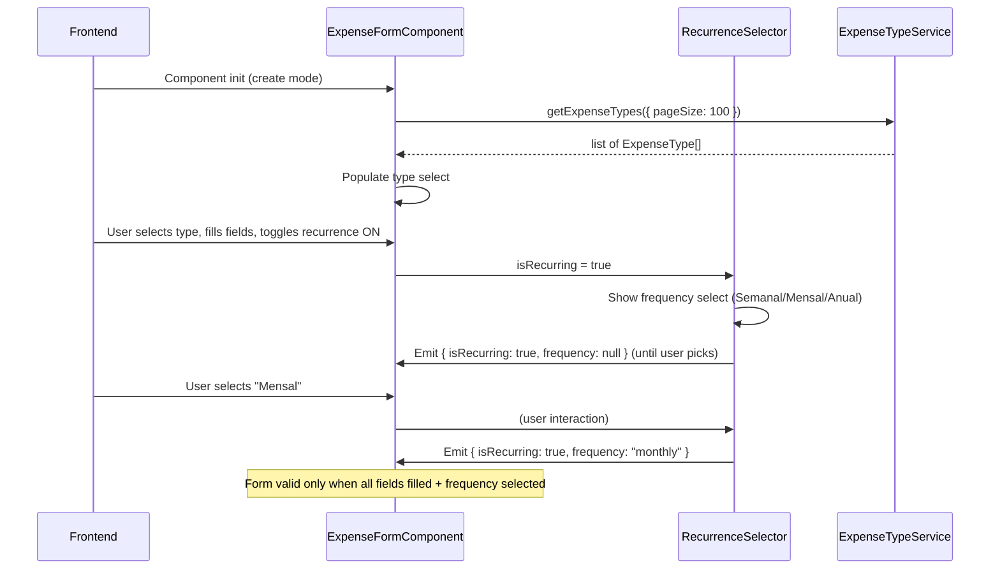

# Design Document — module-expenses

## Overview

This design covers the full vertical slice for Expenses: a RESTful CRUD API (backend) and the
Angular SPA feature module (frontend) that consumes it. The module manages user-scoped financial
expense entries with optional recurrence and classification by expense type — the third business
module after Expense Types and Incomes.

The domain entity `Expense` (Id int, UserId Guid, DueDate DateOnly, Description string max 300,
ExpenseTypeId int FK, Value decimal(18,2), IsRecurring bool, Frequency RecurrenceFrequency?)
already exists with its EF Core configuration, `RecurrenceFrequencyConverter` (persists enum as
lowercase text), FK Restrict to `ExpenseType`, and a composite index `(UserId, DueDate)`. No new
migration is needed.

### Key Design Decisions

| Decision | Rationale |
|----------|-----------|
| Reuse existing `PagedResult<T>` + `ToPagedResultAsync` | Established pattern from Users, ExpenseTypes, and Incomes modules |
| Single `ExpenseFormComponent` for create/edit | Route param `:id` distinguishes mode; reduces code surface |
| Reuse `RecurrenceSelector` shared CVA | Already exists from module-incomes; same recurrence UX |
| Reuse `CurrencyMask` directive in `shared/` | Already exists; same formatting across monetary inputs |
| Reuse `ConfirmDialogComponent` | Already exists; same delete confirmation UX |
| Default ordering by `DueDate DESC` | Most recent expenses first — matches user expectation |
| Conditional validation in FluentValidation | `frequency` required when `isRecurring=true`, must be null when `false` |
| Multi-tenant via `ICurrentUserService` | Consistent with all modules; all queries filter by `UserId` from JWT claims |
| `ExpenseTypeId` ownership validation in service | Before create/update, verify the referenced type belongs to the authenticated user |
| `ExpenseTypeName` via Select projection (join) | Avoid loading full `ExpenseType` entity via Include; project directly in the query |
| `Update` method on entity | Expose a public `Update(...)` method for controlled mutation, matching `Income.Update()` pattern |
| Overdue detection on frontend only | `DueDate < today` comparison uses browser date; no backend field needed |
| Value displayed in danger color (`#ef4444`) | Expenses are outflows — visually distinct from income's success color (`#10b981`) |

## Architecture



### Layer Responsibility

| Layer | Component | Responsibility |
|-------|-----------|----------------|
| Api | `ExpensesController` | Map HTTP verbs to service calls, return status codes |
| Application | `IExpenseService` / DTOs / Validators | Service interface, data shapes, FluentValidation rules |
| Infrastructure | `ExpenseService` | Business logic: CRUD, filtering, pagination, multi-tenant, ExpenseType ownership check |
| Domain | `Expense` entity + `RecurrenceFrequency` enum | Data invariants, controlled mutation |
| Infrastructure | `ExpenseConfiguration` | EF Core mapping (already exists) |
| Frontend | `ExpenseService` | HTTP calls to `/api/expenses`, typed observables |
| Frontend | `ExpenseTypeService` (existing) | HTTP calls to `/api/expense-types` for type select/filter |
| Frontend | `ExpenseListComponent` | Table with filters (incl. type), pagination, overdue highlight, loading/empty/error states |
| Frontend | `ExpenseFormComponent` | Reactive form, create/edit mode, type select, recurrence toggle, currency mask |
| Frontend (shared) | `RecurrenceSelector` | Shared CVA: toggle + frequency select (already exists) |
| Frontend (shared) | `CurrencyMask` | Shared directive: BRL formatting (already exists) |
| Frontend (shared) | `ConfirmDialogComponent` | Shared modal: confirm delete (already exists) |

## Components and Interfaces

### Backend

#### DTOs (Paga.Application/Expenses/)

```csharp
/// <summary>Input for creating an expense.</summary>
public record CreateExpenseRequest(
    DateOnly DueDate,
    string Description,
    int ExpenseTypeId,
    decimal Value,
    bool IsRecurring,
    string? Frequency);

/// <summary>Input for updating an expense.</summary>
public record UpdateExpenseRequest(
    DateOnly DueDate,
    string Description,
    int ExpenseTypeId,
    decimal Value,
    bool IsRecurring,
    string? Frequency);

/// <summary>Output returned by all expense endpoints.</summary>
public record ExpenseResponse(
    int Id,
    string DueDate,
    string Description,
    int ExpenseTypeId,
    string ExpenseTypeName,
    decimal Value,
    bool IsRecurring,
    string? Frequency);

/// <summary>Query parameters for listing expenses.</summary>
public record ExpenseFilter(
    DateOnly? DueDateFrom,
    DateOnly? DueDateTo,
    int? ExpenseTypeId,
    string? Description,
    bool? IsRecurring,
    int PageNumber = 1,
    int PageSize = 10);
```

#### Validators (Paga.Application/Expenses/)

```csharp
public class CreateExpenseRequestValidator : AbstractValidator<CreateExpenseRequest>
{
    public CreateExpenseRequestValidator()
    {
        RuleFor(x => x.DueDate)
            .NotEmpty().WithMessage("A data de vencimento é obrigatória.");

        RuleFor(x => x.Description)
            .NotEmpty().WithMessage("A descrição é obrigatória.")
            .MaximumLength(300).WithMessage("A descrição deve ter no máximo 300 caracteres.");

        RuleFor(x => x.ExpenseTypeId)
            .GreaterThan(0).WithMessage("O tipo de despesa é obrigatório.");

        RuleFor(x => x.Value)
            .GreaterThan(0).WithMessage("O valor deve ser maior que zero.");

        RuleFor(x => x.Frequency)
            .NotEmpty().WithMessage("A frequência é obrigatória para despesas recorrentes.")
            .Must(f => new[] { "weekly", "monthly", "yearly" }.Contains(f))
            .WithMessage("Frequência inválida. Valores aceitos: weekly, monthly, yearly.")
            .When(x => x.IsRecurring);

        RuleFor(x => x.Frequency)
            .Null().WithMessage("A frequência deve ser nula para despesas não recorrentes.")
            .When(x => !x.IsRecurring);
    }
}

// UpdateExpenseRequestValidator follows the same rules
```

#### Service Interface (Paga.Application/Abstractions/)

```csharp
public interface IExpenseService
{
    Task<PagedResult<ExpenseResponse>> GetAllAsync(ExpenseFilter filter, CancellationToken ct = default);
    Task<ExpenseResponse> GetByIdAsync(int id, CancellationToken ct = default);
    Task<ExpenseResponse> CreateAsync(CreateExpenseRequest dto, CancellationToken ct = default);
    Task<ExpenseResponse> UpdateAsync(int id, UpdateExpenseRequest dto, CancellationToken ct = default);
    Task DeleteAsync(int id, CancellationToken ct = default);
}
```

#### Service Implementation (Paga.Infrastructure/Services/ExpenseService.cs)

Key behaviors:
- `GetAllAsync`: filters by `UserId`, optional `DueDateFrom`/`DueDateTo`/`ExpenseTypeId`/
  `Description`/`IsRecurring`, `AsNoTracking`, **joins `ExpenseTypes`** to project
  `ExpenseTypeName` directly in `Select`, orders by `DueDate DESC`, applies `ToPagedResultAsync`.
- `GetByIdAsync`: queries by `Id` AND `UserId`; joins `ExpenseTypes` for `ExpenseTypeName`;
  throws `NotFoundException` if not found.
- `CreateAsync`: derives `UserId` from `ICurrentUserService`; **validates that `ExpenseTypeId`
  belongs to the authenticated user** (queries `ExpenseTypes` table); parses `Frequency` string
  to `RecurrenceFrequency?` enum; creates `Expense` entity; after save, queries back with join
  for `ExpenseTypeName`; returns DTO.
- `UpdateAsync`: loads by `Id` AND `UserId`; throws `NotFoundException` if missing; **validates
  that `ExpenseTypeId` belongs to the authenticated user** (if changed); calls
  `entity.Update(...)` with new values; saves; queries back with join for `ExpenseTypeName`;
  returns updated DTO.
- `DeleteAsync`: loads by `Id` AND `UserId`; throws `NotFoundException` if missing; removes entity.

**ExpenseTypeId validation:** Before creating or updating, the service queries
`_context.ExpenseTypes.AnyAsync(et => et.Id == dto.ExpenseTypeId && et.UserId == userId)`.
If false, throws a `ValidationException` with message "O tipo de despesa informado não existe ou
não pertence ao usuário." (HTTP 400).

#### Controller (Paga.Api/Controllers/ExpensesController.cs)

```csharp
[ApiController]
[Route("api/expenses")]
[Authorize]
public class ExpensesController : ControllerBase
{
    // GET    /api/expenses?dueDateFrom=&dueDateTo=&expenseTypeId=&description=&isRecurring=&pageNumber=1&pageSize=10
    //        → 200 PagedResult<ExpenseResponse>
    // GET    /api/expenses/{id}  → 200 ExpenseResponse | 404
    // POST   /api/expenses       → 201 ExpenseResponse (Location header)
    // PUT    /api/expenses/{id}  → 200 ExpenseResponse | 404
    // DELETE /api/expenses/{id}  → 204 | 404
}
```

The controller follows the same thin pattern as `IncomesController`: delegates entirely to
service, maps results to HTTP status codes. `CreatedAtAction` for POST, `NoContent` for DELETE.

### Frontend

#### Model (features/expenses/expense.model.ts)

```typescript
export interface Expense {
  id: number;
  dueDate: string;           // yyyy-MM-dd
  description: string;
  expenseTypeId: number;
  expenseTypeName: string;
  value: number;
  isRecurring: boolean;
  frequency: string | null;  // 'weekly' | 'monthly' | 'yearly' | null
}

export interface CreateExpenseRequest {
  dueDate: string;
  description: string;
  expenseTypeId: number;
  value: number;
  isRecurring: boolean;
  frequency: string | null;
}

export interface UpdateExpenseRequest {
  dueDate: string;
  description: string;
  expenseTypeId: number;
  value: number;
  isRecurring: boolean;
  frequency: string | null;
}

export interface ExpenseListParams {
  dueDateFrom?: string;
  dueDateTo?: string;
  expenseTypeId?: number;
  description?: string;
  isRecurring?: boolean;
  pageNumber: number;
  pageSize: number;
}
```

#### Service (features/expenses/expense.service.ts)

```typescript
@Injectable({ providedIn: 'root' })
export class ExpenseService {
  private readonly http = inject(HttpClient);
  private readonly apiUrl = environment.apiUrl;

  getExpenses(params: ExpenseListParams): Observable<PaginatedResponse<Expense>> {
    let httpParams = new HttpParams()
      .set('pageNumber', params.pageNumber)
      .set('pageSize', params.pageSize);

    if (params.dueDateFrom) httpParams = httpParams.set('dueDateFrom', params.dueDateFrom);
    if (params.dueDateTo) httpParams = httpParams.set('dueDateTo', params.dueDateTo);
    if (params.expenseTypeId) httpParams = httpParams.set('expenseTypeId', params.expenseTypeId);
    if (params.description) httpParams = httpParams.set('description', params.description);
    if (params.isRecurring !== undefined && params.isRecurring !== null) {
      httpParams = httpParams.set('isRecurring', String(params.isRecurring));
    }

    return this.http.get<PaginatedResponse<Expense>>(`${this.apiUrl}/expenses`, { params: httpParams });
  }

  getExpense(id: number): Observable<Expense> { ... }
  createExpense(data: CreateExpenseRequest): Observable<Expense> { ... }
  updateExpense(id: number, data: UpdateExpenseRequest): Observable<Expense> { ... }
  deleteExpense(id: number): Observable<void> { ... }
}
```

#### Routes (features/expenses/expenses.routes.ts)

```typescript
export const EXPENSES_ROUTES: Routes = [
  { path: '',         loadComponent: () => import('./expense-list/...').then(m => m.ExpenseListComponent) },
  { path: 'new',     loadComponent: () => import('./expense-form/...').then(m => m.ExpenseFormComponent) },
  { path: ':id/edit', loadComponent: () => import('./expense-form/...').then(m => m.ExpenseFormComponent) },
];
```

#### ExpenseListComponent

- Signals: `expenses`, `totalCount`, `totalPages`, `isLoading`, `error`, `pageNumber`, `pageSize`,
  `expenseTypes` (loaded from `ExpenseTypeService` for filter select)
- Filter controls: `dueDateFrom` (DatePicker), `dueDateTo` (DatePicker), `expenseTypeId`
  (mat-select loaded from API), `description` (FormControl with `debounceTime(300)` +
  `distinctUntilChanged`), `isRecurring` (select: Todos/Sim/Nao)
- Table columns: `dueDate`, `description`, `expenseTypeName`, `value`, `isRecurring`, `actions`
  (edit + delete)
- DueDate displayed as `dd/MM/yyyy`; Value displayed as `R$ 1.234,56` in danger color (`#ef4444`)
- Recurrence displayed as "Sim" / "Nao"
- **Overdue highlight:** when `dueDate < today`, row gets background `#fef6f6` and date text
  gets color `#ef4444`
- States: loading skeleton, empty state ("Nenhum registro encontrado"), error with "Tentar
  Novamente"
- Delete: opens `ConfirmDialogComponent` → confirm calls `deleteExpense` → snackbar → reload
- Any filter change resets pagination to page 1
- ExpenseType select loaded on init from `ExpenseTypeService.getExpenseTypes()` (unpaginated or
  large pageSize to get all user types)

#### ExpenseFormComponent

- Mode derived from route: `create` (no `:id`) vs `edit` (has `:id`)
- Reactive form with controls: `dueDate` (required), `description` (required), `expenseTypeId`
  (required, mat-select loaded from API), `value` (required, > 0, uses `CurrencyMask`),
  `recurrence` (uses `RecurrenceSelector` CVA)
- Title: "Nova Despesa" in create mode, "Editar Despesa" in edit mode
- On init: loads expense types from `ExpenseTypeService` for the select; in edit mode also loads
  expense via `getExpense(id)` → populates form; 404 navigates back with error snackbar
- On init: if ExpenseType list load fails → shows error state
- Save: disables button during submission; on success → snackbar + navigate to list; on error →
  API message in snackbar
- Cancel: navigates back without request

#### Overdue Detection Logic

```typescript
isOverdue(expense: Expense): boolean {
  const today = new Date();
  today.setHours(0, 0, 0, 0);
  const [year, month, day] = expense.dueDate.split('-').map(Number);
  const dueDate = new Date(year, month - 1, day);
  return dueDate < today;
}
```

Applied via CSS classes in the template:
- Row: `[class.overdue-row]="isOverdue(expense)"` → `background-color: #fef6f6`
- Date cell: `[class.overdue-date]="isOverdue(expense)"` → `color: #ef4444`

## Data Models

### Database (existing — no changes needed)

```
Table: expenses
├── id               int             IDENTITY, PK
├── user_id          uuid            FK → users(id) CASCADE, NOT NULL
├── due_date         date            NOT NULL
├── description      varchar(300)    NOT NULL
├── expense_type_id  int             FK → expense_types(id) RESTRICT, NOT NULL
├── value            decimal(18,2)   NOT NULL
├── is_recurring     boolean         NOT NULL, DEFAULT false
└── frequency        varchar(10)     NULL ('weekly'|'monthly'|'yearly')

Index: IX_expenses_user_id_due_date (user_id, due_date)
FK: FK_expenses_expense_types_expense_type_id → RESTRICT (no cascade delete)
```

### Entity (existing — needs Update method added)

```csharp
public class Expense
{
    public int Id { get; private set; }
    public Guid UserId { get; private set; }
    public DateOnly DueDate { get; private set; }
    public string Description { get; private set; }
    public int ExpenseTypeId { get; private set; }
    public decimal Value { get; private set; }
    public bool IsRecurring { get; private set; }
    public RecurrenceFrequency? Frequency { get; private set; }

    public Expense(Guid userId, DateOnly dueDate, string description, int expenseTypeId,
                   decimal value, bool isRecurring, RecurrenceFrequency? frequency) { ... }

    /// <summary>Updates all mutable fields for an edit operation.</summary>
    public void Update(DateOnly dueDate, string description, int expenseTypeId,
                       decimal value, bool isRecurring, RecurrenceFrequency? frequency)
    {
        DueDate = dueDate;
        Description = description;
        ExpenseTypeId = expenseTypeId;
        Value = value;
        IsRecurring = isRecurring;
        Frequency = frequency;
    }
}
```

### Request/Response Flows












## Correctness Properties

*A property is a characteristic or behavior that should hold true across all valid executions of a system — essentially, a formal statement about what the system should do. Properties serve as the bridge between human-readable specifications and machine-verifiable correctness guarantees.*

### Property 1: Recurrence validation consistency

*For any* expense payload where `isRecurring` is `true`, the system SHALL reject the request with HTTP 400 if `frequency` is null or not one of `weekly`, `monthly`, `yearly`; and *for any* payload where `isRecurring` is `false`, the system SHALL reject if `frequency` is not null.

**Validates: Requirements 3.7, 3.8, 4.8, 4.9**

### Property 2: Multi-tenant isolation on reads

*For any* two distinct users A and B, and *for any* expense created by user A, a query by user B (listing or by ID) SHALL never return that expense.

**Validates: Requirements 1.1, 6.1, 6.2**

### Property 3: Multi-tenant isolation on writes

*For any* expense owned by user A, an update or delete attempt by user B SHALL result in HTTP 404, regardless of the expense's ID.

**Validates: Requirements 2.2, 4.2, 5.2, 6.2**

### Property 4: Value positivity invariant

*For any* create or update request, the system SHALL reject with HTTP 400 if `value <= 0`.

**Validates: Requirements 3.4, 4.5**

### Property 5: Filter correctness

*For any* set of expenses with varying due dates, types, descriptions, and recurrence flags, when any combination of filters (`dueDateFrom`, `dueDateTo`, `expenseTypeId`, `description`, `isRecurring`) is applied, every returned expense SHALL satisfy ALL active filter constraints: `dueDate >= dueDateFrom` (when provided), `dueDate <= dueDateTo` (when provided), `expenseTypeId` matches (when provided), description contains the search term case-insensitively (when provided), and `isRecurring` matches (when provided).

**Validates: Requirements 1.2, 1.3, 1.4, 1.5, 1.6**

### Property 6: Pagination envelope integrity

*For any* list query, the returned `totalCount` SHALL equal the number of matching records, `totalPages` SHALL equal `ceil(totalCount / pageSize)`, and `items.length` SHALL be `<= pageSize`.

**Validates: Requirements 1.7**

### Property 7: ExpenseType ownership validation

*For any* expense creation or update request referencing an `expenseTypeId` that does not belong to the authenticated user (either non-existent or belonging to another user), the system SHALL reject with HTTP 400.

**Validates: Requirements 3.6, 6.4**

### Property 8: Overdue detection correctness

*For any* expense, the frontend overdue detection function SHALL return `true` if and only if `dueDate` is strictly before today's date (comparing date-only, no time component).

**Validates: Requirements 12.1, 12.2, 12.3, 12.4**

## Error Handling

| Scenario | Layer | Mechanism | HTTP Status |
|----------|-------|-----------|-------------|
| Missing/empty description | Validator (pipeline) | FluentValidation → ProblemDetails | 400 |
| Missing dueDate | Validator (pipeline) | FluentValidation → ProblemDetails | 400 |
| Value ≤ 0 | Validator (pipeline) | FluentValidation → ProblemDetails | 400 |
| Missing expenseTypeId | Validator (pipeline) | FluentValidation → ProblemDetails | 400 |
| Frequency null when isRecurring=true | Validator (pipeline) | FluentValidation → ProblemDetails | 400 |
| Frequency non-null when isRecurring=false | Validator (pipeline) | FluentValidation → ProblemDetails | 400 |
| Invalid frequency value | Validator (pipeline) | FluentValidation → ProblemDetails | 400 |
| ExpenseTypeId not owned by user | Service | `throw ValidationException(...)` | 400 |
| No/invalid JWT token | Auth middleware | ASP.NET `[Authorize]` | 401 |
| ID not found or belongs to other user | Service | `throw new NotFoundException(...)` | 404 |
| DELETE expense-type with linked expenses | ExpenseTypeService | `throw new ConflictException(...)` | 409 |
| Unexpected error | Global handler | Generic message, details in Serilog | 500 |

### Frontend Error Handling

| API Status | Frontend Behavior |
|------------|-------------------|
| 200/201/204 | Success snackbar + navigate to list |
| 400 | Display validation errors from ProblemDetails in snackbar |
| 401 | Interceptor handles: refresh attempt → if fails, redirect to login |
| 404 (edit form load) | Navigate back to list + error snackbar |
| 409 | Display conflict message from API in snackbar (expense-types module handles this) |
| 500 | Generic error snackbar "Erro ao processar a solicitação" |
| Network error | Error state with "Tentar Novamente" button (list) or snackbar (form) |

## Testing Strategy

### PBT Applicability Assessment

The Expense module has **conditional validation logic** (recurrence rules), **multi-tenant
filtering**, **cross-entity ownership validation** (ExpenseType must belong to same user), and
**date filter correctness** that benefit from property-based testing. The `isRecurring ↔ frequency`
relationship creates a combinatorial space that PBT can explore effectively. The ExpenseType
ownership check adds a new cross-entity validation dimension beyond what Incomes had. Additionally,
the overdue detection is a pure function with a clear invariant across all date values.

**PBT Library:** [FsCheck](https://fscheck.github.io/FsCheck/) for .NET backend (integrates with
xUnit via `FsCheck.Xunit`). For frontend overdue detection, Jasmine with generated date inputs.

Each property test runs **minimum 100 iterations** with generated inputs.

### Backend Tests (xUnit)

#### Unit Tests (Paga.Tests/Unit/Expenses/)

**ExpenseServiceTests:**
- `GetAllAsync_ShouldReturnOnlyCurrentUserExpenses`
- `GetAllAsync_ShouldFilterByDueDateFrom`
- `GetAllAsync_ShouldFilterByDueDateTo`
- `GetAllAsync_ShouldFilterByExpenseTypeId`
- `GetAllAsync_ShouldFilterByDescription_CaseInsensitive`
- `GetAllAsync_ShouldFilterByIsRecurring`
- `GetAllAsync_ShouldOrderByDueDateDescending`
- `GetAllAsync_ShouldIncludeExpenseTypeName`
- `GetByIdAsync_ShouldReturnExpense_WhenExistsForCurrentUser`
- `GetByIdAsync_ShouldReturnExpenseTypeName`
- `GetByIdAsync_ShouldThrowNotFound_WhenIdDoesNotExist`
- `GetByIdAsync_ShouldThrowNotFound_WhenBelongsToOtherUser`
- `CreateAsync_ShouldCreateAndReturnDto_WhenValid`
- `CreateAsync_ShouldCreateRecurringExpense_WhenFrequencyProvided`
- `CreateAsync_ShouldReject_WhenExpenseTypeIdBelongsToOtherUser`
- `CreateAsync_ShouldReject_WhenExpenseTypeIdDoesNotExist`
- `UpdateAsync_ShouldUpdateAllFields_WhenValid`
- `UpdateAsync_ShouldThrowNotFound_WhenIdDoesNotExist`
- `UpdateAsync_ShouldThrowNotFound_WhenBelongsToOtherUser`
- `UpdateAsync_ShouldToggleRecurrence_FromFalseToTrue`
- `UpdateAsync_ShouldChangeExpenseTypeId`
- `UpdateAsync_ShouldReject_WhenNewExpenseTypeIdBelongsToOtherUser`
- `DeleteAsync_ShouldDelete_WhenExistsForCurrentUser`
- `DeleteAsync_ShouldThrowNotFound_WhenIdDoesNotExist`
- `DeleteAsync_ShouldThrowNotFound_WhenBelongsToOtherUser`

**Validator Tests (CreateExpenseRequestValidatorTests + UpdateExpenseRequestValidatorTests):**
- `ShouldFail_WhenDueDateMissing`
- `ShouldFail_WhenDescriptionEmpty`
- `ShouldFail_WhenExpenseTypeIdZero`
- `ShouldFail_WhenValueZero`
- `ShouldFail_WhenValueNegative`
- `ShouldFail_WhenRecurringWithoutFrequency`
- `ShouldFail_WhenRecurringWithInvalidFrequency`
- `ShouldFail_WhenNotRecurringWithFrequency`
- `ShouldPass_WhenAllFieldsValid_NonRecurring`
- `ShouldPass_WhenAllFieldsValid_Recurring`

**Property Tests (ExpenseValidationPropertyTests):**
- Tag: `Feature: module-expenses, Property 1: Recurrence validation consistency`
- Tag: `Feature: module-expenses, Property 4: Value positivity invariant`
- Tag: `Feature: module-expenses, Property 7: ExpenseType ownership validation`

#### Integration Tests (Paga.Tests/Integration/Expenses/)

Using `WebApplicationFactory` + Testcontainers PostgreSQL:

- `POST /api/expenses` → 201 with valid non-recurring payload (includes `expenseTypeName`)
- `POST /api/expenses` → 201 with valid recurring payload (frequency=monthly)
- `POST /api/expenses` → 400 with isRecurring=true and frequency=null
- `POST /api/expenses` → 400 with value ≤ 0
- `POST /api/expenses` → 400 with missing description
- `POST /api/expenses` → 400 with expenseTypeId not belonging to user
- `POST /api/expenses` → 400 with non-existent expenseTypeId
- `GET /api/expenses` → 200 with paginated results, only current user's expenses
- `GET /api/expenses?dueDateFrom=...&dueDateTo=...` → 200 filtered by date range
- `GET /api/expenses?expenseTypeId=...` → 200 filtered by expense type
- `GET /api/expenses?description=test` → 200 filtered by description (case-insensitive)
- `GET /api/expenses?isRecurring=true` → 200 filtered by recurrence
- `GET /api/expenses/{id}` → 200 for own expense (with `expenseTypeName`)
- `GET /api/expenses/{id}` → 404 for other user's expense
- `GET /api/expenses/{id}` → 404 for non-existent id
- `PUT /api/expenses/{id}` → 200 with updated fields (including changed type)
- `PUT /api/expenses/{id}` → 200 toggling isRecurring from false to true
- `PUT /api/expenses/{id}` → 404 for other user's expense
- `PUT /api/expenses/{id}` → 400 with expenseTypeId belonging to other user
- `PUT /api/expenses/{id}` → 400 with isRecurring=false and frequency=monthly
- `DELETE /api/expenses/{id}` → 204 for own expense
- `DELETE /api/expenses/{id}` → 404 for other user's expense
- Requests without token → 401
- Isolation: user A cannot read, update, or delete user B's expense
- Referential integrity: `DELETE /api/expense-types/{id}` → 409 when type has linked expenses
- Referential integrity: `DELETE /api/expense-types/{id}` → 204 when type has no expenses

### Frontend Tests (Karma/Jasmine)

**ExpenseService (expense.service.spec.ts):**
- Correct HTTP method, URL for each operation
- Query params correctly serialized for list with all filter combinations (including `expenseTypeId`)
- Handles date params as strings in `yyyy-MM-dd` format

**ExpenseListComponent (expense-list.component.spec.ts):**
- Renders table with correct columns (Vencimento, Descrição, Tipo, Valor, Recorrente)
- DueDate formatted as `dd/MM/yyyy`
- Value formatted as `R$ 1.234,56` with danger color (`#ef4444`)
- ExpenseTypeName displayed in Tipo column
- Recurrence shows "Sim" / "Não"
- Description filter triggers with 300ms debounce
- Date pickers trigger API call and reset pagination
- ExpenseTypeId select triggers API call
- IsRecurring select triggers API call
- Expense types loaded on init for filter select
- Overdue rows get background `#fef6f6`
- Overdue date text gets color `#ef4444`
- Non-overdue rows have default styling
- Displays loading skeleton during fetch
- Displays empty state when no results
- Displays error state with retry button on failure
- Edit button navigates to `:id/edit`
- Delete opens confirm dialog; confirm calls API and shows snackbar
- "+ Nova Despesa" button navigates to `/expenses/new`

**ExpenseFormComponent (expense-form.component.spec.ts):**
- Create mode: shows "Nova Despesa" title, empty form
- Edit mode: loads data, shows "Editar Despesa" title, pre-fills form
- Edit mode: pre-selects expenseTypeId in the type select
- Edit mode: navigates back with error snackbar on 404
- Validates dueDate required
- Validates description required
- Validates expenseTypeId required (select must have value)
- Validates value required and > 0
- RecurrenceSelector integration: toggle shows/hides frequency
- Loads expense types on init for type select
- Shows error state when expense type loading fails
- Submit calls correct API method (POST for create, PUT for edit)
- Disables save button during submission
- Shows success snackbar and navigates on success
- Shows API error message on 400/500
- Cancel navigates back without API call

**Overdue detection (expense-list.component.spec.ts — dedicated describe block):**
- `isOverdue` returns true for dueDate yesterday
- `isOverdue` returns false for dueDate today
- `isOverdue` returns false for dueDate tomorrow
- Correct CSS class applied to overdue rows
- No CSS class applied to non-overdue rows
