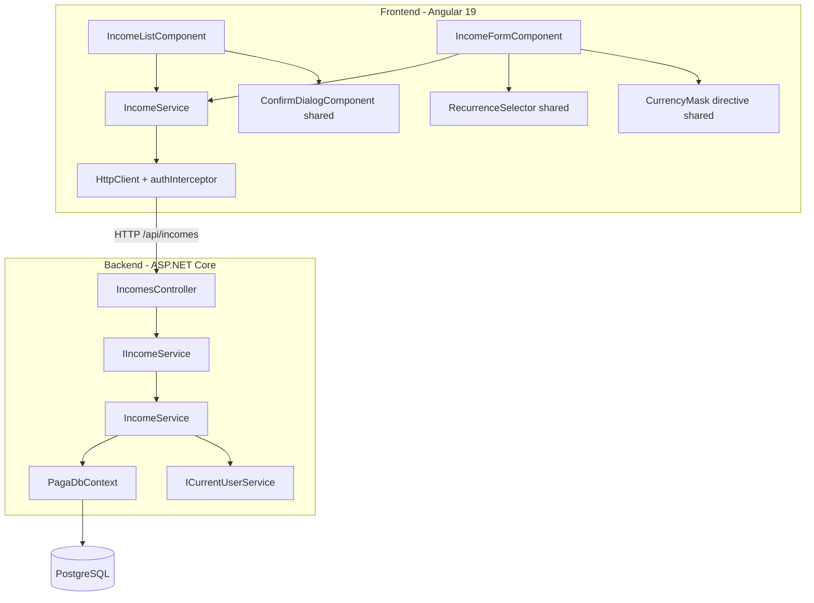
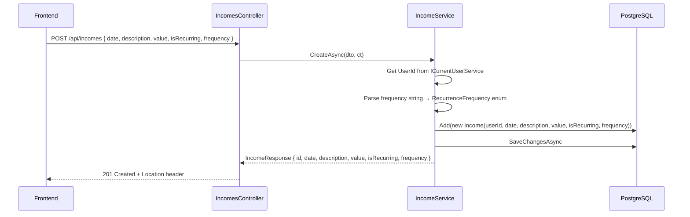
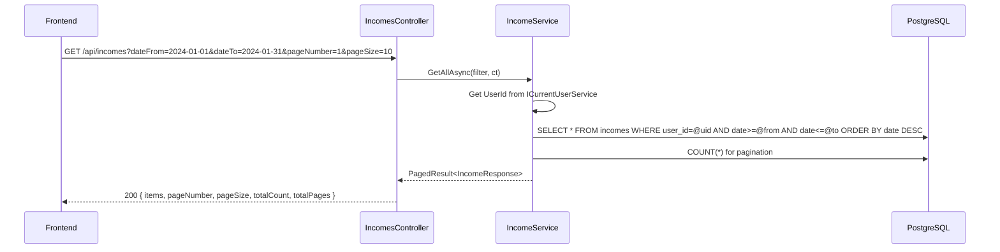
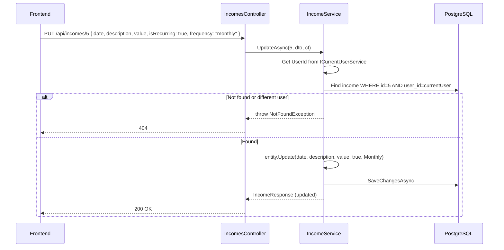
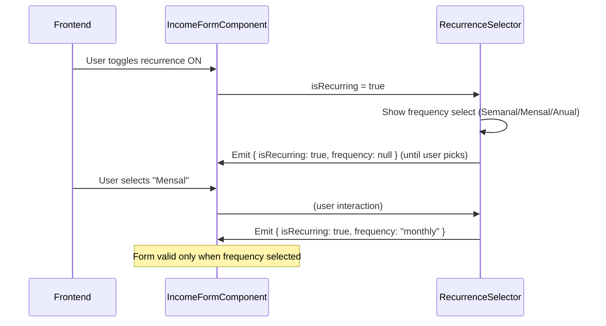

# Design Document — module-incomes

## Overview

This design covers the full vertical slice for Incomes: a RESTful CRUD API (backend) and the
Angular SPA feature module (frontend) that consumes it. The module manages user-scoped financial
income entries with optional recurrence — the second business module after Expense Types.

The domain entity `Income` (Id int, UserId Guid, Date DateOnly, Description string max 300,
Value decimal(18,2), IsRecurring bool, Frequency RecurrenceFrequency?) already exists with its
EF Core configuration, `RecurrenceFrequencyConverter` (persists enum as lowercase text), and a
composite index `(UserId, Date)`. No new migration is needed.

### Key Design Decisions

| Decision | Rationale |
|----------|-----------|
| Reuse existing `PagedResult<T>` + `ToPagedResultAsync` | Established pattern from Users and ExpenseTypes modules |
| Single `IncomeFormComponent` for create/edit | Route param `:id` distinguishes mode; reduces code surface |
| `RecurrenceSelector` as shared `ControlValueAccessor` | Reusable by both Incomes and future Expenses modules |
| `CurrencyMask` directive in `shared/` | Reusable formatting across all monetary input fields |
| Default ordering by `Date DESC` | Most recent incomes first — matches user expectation |
| Conditional validation in FluentValidation | `frequency` required when `isRecurring=true`, must be null when `false` |
| Multi-tenant via `ICurrentUserService` | Consistent with ExpenseTypes module; all queries filter by `UserId` from JWT claims |
| No uniqueness constraint on Income | Unlike ExpenseType, incomes are not unique by any business field |
| `Update` method on entity | Expose a public `Update(...)` method for controlled mutation, matching `ExpenseType.UpdateName()` pattern |

## Architecture



### Layer Responsibility

| Layer | Component | Responsibility |
|-------|-----------|----------------|
| Api | `IncomesController` | Map HTTP verbs to service calls, return status codes |
| Application | `IIncomeService` / DTOs / Validators | Service interface, data shapes, FluentValidation rules |
| Infrastructure | `IncomeService` | Business logic: CRUD, filtering, pagination, multi-tenant |
| Domain | `Income` entity + `RecurrenceFrequency` enum | Data invariants, controlled mutation |
| Infrastructure | `IncomeConfiguration` | EF Core mapping (already exists) |
| Frontend | `IncomeService` | HTTP calls to API, typed observables |
| Frontend | `IncomeListComponent` | Table with filters, pagination, loading/empty/error states |
| Frontend | `IncomeFormComponent` | Reactive form, create/edit mode, recurrence toggle, currency mask |
| Frontend | `RecurrenceSelector` | Shared CVA: toggle + frequency select |
| Frontend | `CurrencyMask` | Shared directive: BRL formatting, numeric value exposure |

## Components and Interfaces

### Backend

#### DTOs (Paga.Application/Incomes/)

```csharp
/// <summary>Input for creating an income.</summary>
public record CreateIncomeRequest(
    DateOnly Date,
    string Description,
    decimal Value,
    bool IsRecurring,
    string? Frequency);

/// <summary>Input for updating an income.</summary>
public record UpdateIncomeRequest(
    DateOnly Date,
    string Description,
    decimal Value,
    bool IsRecurring,
    string? Frequency);

/// <summary>Output returned by all income endpoints.</summary>
public record IncomeResponse(
    int Id,
    string Date,
    string Description,
    decimal Value,
    bool IsRecurring,
    string? Frequency);

/// <summary>Query parameters for listing incomes.</summary>
public record IncomeFilter(
    DateOnly? DateFrom,
    DateOnly? DateTo,
    string? Description,
    bool? IsRecurring,
    int PageNumber = 1,
    int PageSize = 10);
```

#### Validators (Paga.Application/Incomes/)

```csharp
public class CreateIncomeRequestValidator : AbstractValidator<CreateIncomeRequest>
{
    public CreateIncomeRequestValidator()
    {
        RuleFor(x => x.Date)
            .NotEmpty().WithMessage("A data é obrigatória.");

        RuleFor(x => x.Description)
            .NotEmpty().WithMessage("A descrição é obrigatória.")
            .MaximumLength(300).WithMessage("A descrição deve ter no máximo 300 caracteres.");

        RuleFor(x => x.Value)
            .GreaterThan(0).WithMessage("O valor deve ser maior que zero.");

        RuleFor(x => x.Frequency)
            .NotEmpty().WithMessage("A frequência é obrigatória para receitas recorrentes.")
            .Must(f => new[] { "weekly", "monthly", "yearly" }.Contains(f))
            .WithMessage("Frequência inválida. Valores aceitos: weekly, monthly, yearly.")
            .When(x => x.IsRecurring);

        RuleFor(x => x.Frequency)
            .Null().WithMessage("A frequência deve ser nula para receitas não recorrentes.")
            .When(x => !x.IsRecurring);
    }
}

// UpdateIncomeRequestValidator follows the same rules
```

#### Service Interface (Paga.Application/Abstractions/)

```csharp
public interface IIncomeService
{
    Task<PagedResult<IncomeResponse>> GetAllAsync(IncomeFilter filter, CancellationToken ct = default);
    Task<IncomeResponse> GetByIdAsync(int id, CancellationToken ct = default);
    Task<IncomeResponse> CreateAsync(CreateIncomeRequest dto, CancellationToken ct = default);
    Task<IncomeResponse> UpdateAsync(int id, UpdateIncomeRequest dto, CancellationToken ct = default);
    Task DeleteAsync(int id, CancellationToken ct = default);
}
```

#### Service Implementation (Paga.Infrastructure/Services/IncomeService.cs)

Key behaviors:
- `GetAllAsync`: filters by `UserId`, optional `DateFrom`/`DateTo`/`Description`/`IsRecurring`,
  `AsNoTracking`, projects to DTO with `Select`, orders by `Date DESC`, applies `ToPagedResultAsync`.
- `GetByIdAsync`: queries by `Id` AND `UserId`; throws `NotFoundException` if not found.
- `CreateAsync`: derives `UserId` from `ICurrentUserService`; parses `Frequency` string to
  `RecurrenceFrequency?` enum; creates `Income` entity and returns DTO.
- `UpdateAsync`: loads by `Id` AND `UserId`; throws `NotFoundException` if missing; calls
  `entity.Update(...)` with new values; saves and returns updated DTO.
- `DeleteAsync`: loads by `Id` AND `UserId`; throws `NotFoundException` if missing; removes entity.

#### Controller (Paga.Api/Controllers/IncomesController.cs)

```csharp
[ApiController]
[Route("api/incomes")]
[Authorize]
public class IncomesController : ControllerBase
{
    // GET    /api/incomes?dateFrom=&dateTo=&description=&isRecurring=&pageNumber=1&pageSize=10
    //        → 200 PagedResult<IncomeResponse>
    // GET    /api/incomes/{id}  → 200 IncomeResponse | 404
    // POST   /api/incomes       → 201 IncomeResponse (Location header)
    // PUT    /api/incomes/{id}  → 200 IncomeResponse | 404
    // DELETE /api/incomes/{id}  → 204 | 404
}
```

The controller follows the same thin pattern as `ExpenseTypesController`: delegates entirely to
service, maps results to HTTP status codes. `CreatedAtAction` for POST, `NoContent` for DELETE.

### Frontend

#### Model (features/incomes/income.model.ts)

```typescript
export interface Income {
  id: number;
  date: string;           // yyyy-MM-dd
  description: string;
  value: number;
  isRecurring: boolean;
  frequency: string | null; // 'weekly' | 'monthly' | 'yearly' | null
}

export interface CreateIncomeRequest {
  date: string;
  description: string;
  value: number;
  isRecurring: boolean;
  frequency: string | null;
}

export interface UpdateIncomeRequest {
  date: string;
  description: string;
  value: number;
  isRecurring: boolean;
  frequency: string | null;
}

export interface IncomeListParams {
  dateFrom?: string;
  dateTo?: string;
  description?: string;
  isRecurring?: boolean;
  pageNumber: number;
  pageSize: number;
}
```

#### Service (features/incomes/income.service.ts)

```typescript
@Injectable({ providedIn: 'root' })
export class IncomeService {
  private readonly http = inject(HttpClient);
  private readonly apiUrl = environment.apiUrl;

  getIncomes(params: IncomeListParams): Observable<PaginatedResponse<Income>> { ... }
  getIncome(id: number): Observable<Income> { ... }
  createIncome(data: CreateIncomeRequest): Observable<Income> { ... }
  updateIncome(id: number, data: UpdateIncomeRequest): Observable<Income> { ... }
  deleteIncome(id: number): Observable<void> { ... }
}
```

#### Routes (features/incomes/incomes.routes.ts)

```typescript
export const INCOMES_ROUTES: Routes = [
  { path: '',         loadComponent: () => import('./income-list/...').then(m => m.IncomeListComponent) },
  { path: 'new',     loadComponent: () => import('./income-form/...').then(m => m.IncomeFormComponent) },
  { path: ':id/edit', loadComponent: () => import('./income-form/...').then(m => m.IncomeFormComponent) },
];
```

#### IncomeListComponent

- Signals: `incomes`, `totalCount`, `totalPages`, `isLoading`, `error`, `pageNumber`, `pageSize`
- Filter controls: `dateFrom` (DatePicker), `dateTo` (DatePicker), `description` (FormControl
  with `debounceTime(300)` + `distinctUntilChanged`), `isRecurring` (select: Todos/Sim/Não)
- Table columns: `date`, `description`, `value`, `isRecurring`, `actions` (edit + delete)
- Date displayed as `dd/MM/yyyy`; Value displayed as `R$ 1.234,56` in success color (`#10b981`)
- Recurrence displayed as "Sim" / "Não"
- States: loading skeleton, empty state ("Nenhum registro encontrado"), error with "Tentar Novamente"
- Delete: opens `ConfirmDialogComponent` → confirm calls `deleteIncome` → snackbar → reload
- Any filter change resets pagination to page 1

#### IncomeFormComponent

- Mode derived from route: `create` (no `:id`) vs `edit` (has `:id`)
- Reactive form with controls: `date` (required), `description` (required), `value` (required,
  > 0, uses `CurrencyMask`), `recurrence` (uses `RecurrenceSelector` CVA)
- Title: "Nova Receita" in create mode, "Editar Receita" in edit mode
- On init (edit mode): loads income via `getIncome(id)` → populates form; 404 navigates back
  with error snackbar
- Save: disables button during submission; on success → snackbar + navigate to list; on error →
  API message in snackbar
- Cancel: navigates back without request

#### RecurrenceSelector (shared/recurrence-selector/)

```typescript
@Component({
  selector: 'app-recurrence-selector',
  standalone: true,
  providers: [{ provide: NG_VALUE_ACCESSOR, useExisting: RecurrenceSelectorComponent, multi: true }],
  // ...
})
export class RecurrenceSelectorComponent implements ControlValueAccessor {
  // Emits: { isRecurring: boolean, frequency: string | null }
  // When toggle ON: shows mat-select (Semanal/Mensal/Anual), frequency required
  // When toggle OFF: hides mat-select, emits frequency: null
  // Active toggle label styled with blue (#3b82f6) per Figma
}
```

#### CurrencyMask (shared/currency-mask/)

```typescript
@Directive({
  selector: '[appCurrencyMask]',
  standalone: true,
})
export class CurrencyMaskDirective implements ControlValueAccessor {
  // Formats display as R$ 1.234,56 while typing
  // Accepts only digits and decimal separators
  // Exposes raw numeric value to form control
  // Consistent cursor positioning on focus
}
```

## Data Models

### Database (existing — no changes needed)

```
Table: incomes
├── id              int             IDENTITY, PK
├── user_id         uuid            FK → users(id) CASCADE, NOT NULL
├── date            date            NOT NULL
├── description     varchar(300)    NOT NULL
├── value           decimal(18,2)   NOT NULL
├── is_recurring    boolean         NOT NULL, DEFAULT false
└── frequency       varchar(10)     NULL ('weekly'|'monthly'|'yearly')

Index: IX_incomes_user_id_date (user_id, date)
```

### Entity (existing — needs Update method added)

```csharp
public class Income
{
    public int Id { get; private set; }
    public Guid UserId { get; private set; }
    public DateOnly Date { get; private set; }
    public string Description { get; private set; }
    public decimal Value { get; private set; }
    public bool IsRecurring { get; private set; }
    public RecurrenceFrequency? Frequency { get; private set; }

    public Income(Guid userId, DateOnly date, string description, decimal value,
                  bool isRecurring, RecurrenceFrequency? frequency) { ... }

    /// <summary>Updates all mutable fields for an edit operation.</summary>
    public void Update(DateOnly date, string description, decimal value,
                       bool isRecurring, RecurrenceFrequency? frequency)
    {
        Date = date;
        Description = description;
        Value = value;
        IsRecurring = isRecurring;
        Frequency = frequency;
    }
}
```

### Request/Response Flows









## Correctness Properties

*A property is a characteristic or behavior that should hold true across all valid executions of a system — essentially, a formal statement about what the system should do. Properties serve as the bridge between human-readable specifications and machine-verifiable correctness guarantees.*

### Property 1: Recurrence validation consistency

*For any* income payload where `isRecurring` is `true`, the system SHALL reject the request with HTTP 400 if `frequency` is null or not one of `weekly`, `monthly`, `yearly`; and *for any* payload where `isRecurring` is `false`, the system SHALL reject if `frequency` is not null.

**Validates: Requirements 3.5, 3.6, 4.6, 4.7**

### Property 2: Multi-tenant isolation on reads

*For any* two distinct users A and B, and *for any* income created by user A, a query by user B (listing or by ID) SHALL never return that income.

**Validates: Requirements 6.1, 6.2**

### Property 3: Multi-tenant isolation on writes

*For any* income owned by user A, an update or delete attempt by user B SHALL result in HTTP 404, regardless of the income's ID.

**Validates: Requirements 6.2, 6.3**

### Property 4: Value positivity invariant

*For any* create or update request, the system SHALL reject with HTTP 400 if `value <= 0`.

**Validates: Requirements 3.4, 4.5**

### Property 5: Date filter correctness

*For any* set of incomes with varying dates, when `dateFrom` and/or `dateTo` filters are applied, every returned income SHALL have `date >= dateFrom` (when provided) AND `date <= dateTo` (when provided).

**Validates: Requirements 1.2, 1.3**

### Property 6: Pagination envelope integrity

*For any* list query, the returned `totalCount` SHALL equal the number of matching records, `totalPages` SHALL equal `ceil(totalCount / pageSize)`, and `items.length` SHALL be `<= pageSize`.

**Validates: Requirements 1.6**

## Error Handling

| Scenario | Layer | Mechanism | HTTP Status |
|----------|-------|-----------|-------------|
| Missing/empty description | Validator (pipeline) | FluentValidation → ProblemDetails | 400 |
| Missing date | Validator (pipeline) | FluentValidation → ProblemDetails | 400 |
| Value ≤ 0 | Validator (pipeline) | FluentValidation → ProblemDetails | 400 |
| Frequency null when isRecurring=true | Validator (pipeline) | FluentValidation → ProblemDetails | 400 |
| Frequency non-null when isRecurring=false | Validator (pipeline) | FluentValidation → ProblemDetails | 400 |
| Invalid frequency value | Validator (pipeline) | FluentValidation → ProblemDetails | 400 |
| No/invalid JWT token | Auth middleware | ASP.NET `[Authorize]` | 401 |
| ID not found or belongs to other user | Service | `throw new NotFoundException(...)` | 404 |
| Unexpected error | Global handler | Generic message, details in Serilog | 500 |

### Frontend Error Handling

| API Status | Frontend Behavior |
|------------|-------------------|
| 200/201/204 | Success snackbar + navigate to list |
| 400 | Display validation errors from ProblemDetails in snackbar |
| 401 | Interceptor handles: refresh attempt → if fails, redirect to login |
| 404 (edit form load) | Navigate back to list + error snackbar |
| 500 | Generic error snackbar "Erro ao processar a solicitação" |
| Network error | Error state with "Tentar Novamente" button (list) or snackbar (form) |

## Testing Strategy

### PBT Applicability Assessment

The Income module has **conditional validation logic** (recurrence rules) and **multi-tenant
filtering** that benefit from property-based testing. Unlike a simple CRUD where fields are
independent, the `isRecurring ↔ frequency` relationship creates a combinatorial space that PBT
can explore effectively. Additionally, the date filter correctness and pagination invariants are
universal properties testable across generated inputs.

**PBT Library:** [FsCheck](https://fscheck.github.io/FsCheck/) for .NET (integrates with xUnit via `FsCheck.Xunit`).

Each property test runs **minimum 100 iterations** with generated inputs.

### Backend Tests (xUnit)

#### Unit Tests (Paga.Tests/Unit/Incomes/)

**IncomeServiceTests:**
- `GetAllAsync_ShouldReturnOnlyCurrentUserIncomes`
- `GetAllAsync_ShouldFilterByDateFrom`
- `GetAllAsync_ShouldFilterByDateTo`
- `GetAllAsync_ShouldFilterByDescription_CaseInsensitive`
- `GetAllAsync_ShouldFilterByIsRecurring`
- `GetAllAsync_ShouldOrderByDateDescending`
- `GetByIdAsync_ShouldReturnIncome_WhenExistsForCurrentUser`
- `GetByIdAsync_ShouldThrowNotFound_WhenIdDoesNotExist`
- `GetByIdAsync_ShouldThrowNotFound_WhenBelongsToOtherUser`
- `CreateAsync_ShouldCreateAndReturnDto_WhenValid`
- `CreateAsync_ShouldCreateRecurringIncome_WhenFrequencyProvided`
- `UpdateAsync_ShouldUpdateAllFields_WhenValid`
- `UpdateAsync_ShouldThrowNotFound_WhenIdDoesNotExist`
- `UpdateAsync_ShouldThrowNotFound_WhenBelongsToOtherUser`
- `UpdateAsync_ShouldToggleRecurrence_FromFalseToTrue`
- `DeleteAsync_ShouldDelete_WhenExistsForCurrentUser`
- `DeleteAsync_ShouldThrowNotFound_WhenIdDoesNotExist`
- `DeleteAsync_ShouldThrowNotFound_WhenBelongsToOtherUser`

**Validator Tests (CreateIncomeRequestValidatorTests + UpdateIncomeRequestValidatorTests):**
- `ShouldFail_WhenDateMissing`
- `ShouldFail_WhenDescriptionEmpty`
- `ShouldFail_WhenValueZero`
- `ShouldFail_WhenValueNegative`
- `ShouldFail_WhenRecurringWithoutFrequency`
- `ShouldFail_WhenRecurringWithInvalidFrequency`
- `ShouldFail_WhenNotRecurringWithFrequency`
- `ShouldPass_WhenAllFieldsValid_NonRecurring`
- `ShouldPass_WhenAllFieldsValid_Recurring`

**Property Tests (IncomeValidationPropertyTests):**
- Tag: `Feature: module-incomes, Property 1: Recurrence validation consistency`
- Tag: `Feature: module-incomes, Property 4: Value positivity invariant`

#### Integration Tests (Paga.Tests/Integration/Incomes/)

Using `WebApplicationFactory` + Testcontainers PostgreSQL:

- `POST /api/incomes` → 201 with valid non-recurring payload
- `POST /api/incomes` → 201 with valid recurring payload (frequency=monthly)
- `POST /api/incomes` → 400 with isRecurring=true and frequency=null
- `POST /api/incomes` → 400 with value ≤ 0
- `POST /api/incomes` → 400 with missing description
- `GET /api/incomes` → 200 with paginated results, only current user's incomes
- `GET /api/incomes?dateFrom=...&dateTo=...` → 200 filtered by date range
- `GET /api/incomes?description=test` → 200 filtered by description (case-insensitive)
- `GET /api/incomes?isRecurring=true` → 200 filtered by recurrence
- `GET /api/incomes/{id}` → 200 for own income
- `GET /api/incomes/{id}` → 404 for other user's income
- `GET /api/incomes/{id}` → 404 for non-existent id
- `PUT /api/incomes/{id}` → 200 with updated fields
- `PUT /api/incomes/{id}` → 200 toggling isRecurring from false to true
- `PUT /api/incomes/{id}` → 404 for other user's income
- `PUT /api/incomes/{id}` → 400 with isRecurring=false and frequency=monthly
- `DELETE /api/incomes/{id}` → 204 for own income
- `DELETE /api/incomes/{id}` → 404 for other user's income
- Requests without token → 401
- Isolation: user A cannot read, update, or delete user B's income

### Frontend Tests (Karma/Jasmine)

**IncomeService (income.service.spec.ts):**
- Correct HTTP method, URL for each operation
- Query params correctly serialized for list with all filter combinations
- Handles date params as strings in `yyyy-MM-dd` format

**IncomeListComponent (income-list.component.spec.ts):**
- Renders table with correct columns (Data, Descrição, Valor, Recorrente)
- Date formatted as `dd/MM/yyyy`
- Value formatted as `R$ 1.234,56` with success color
- Recurrence shows "Sim" / "Não"
- Description filter triggers with 300ms debounce
- Date pickers trigger API call and reset pagination
- IsRecurring select triggers API call
- Displays loading skeleton during fetch
- Displays empty state when no results
- Displays error state with retry button on failure
- Edit button navigates to `:id/edit`
- Delete opens confirm dialog; confirm calls API and shows snackbar
- "+ Nova Receita" button navigates to `/incomes/new`

**IncomeFormComponent (income-form.component.spec.ts):**
- Create mode: shows "Nova Receita" title, empty form
- Edit mode: loads data, shows "Editar Receita" title, pre-fills form
- Edit mode: navigates back with error snackbar on 404
- Validates date required
- Validates description required
- Validates value required and > 0
- RecurrenceSelector integration: toggle shows/hides frequency
- Submit calls correct API method (POST for create, PUT for edit)
- Disables save button during submission
- Shows success snackbar and navigates on success
- Shows API error message on 400/500
- Cancel navigates back without API call

**RecurrenceSelector (recurrence-selector.component.spec.ts):**
- Toggle ON shows frequency select
- Toggle OFF hides frequency select
- Emits `{ isRecurring: true, frequency: 'monthly' }` when selected
- Emits `{ isRecurring: false, frequency: null }` when toggle off
- Frequency required validation when toggle ON
- Integrates with reactive forms (ControlValueAccessor contract)

**CurrencyMask (currency-mask.directive.spec.ts):**
- Formats input "123456" as "R$ 1.234,56"
- Exposes numeric value 1234.56 to form control
- Rejects non-numeric characters
- Consistent cursor position on focus
