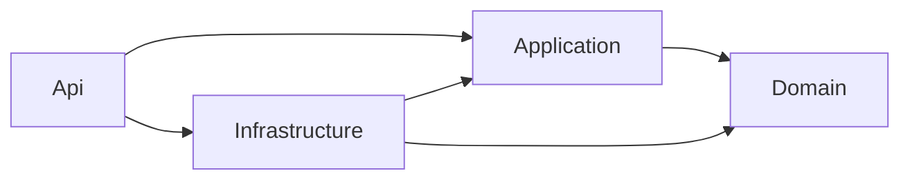
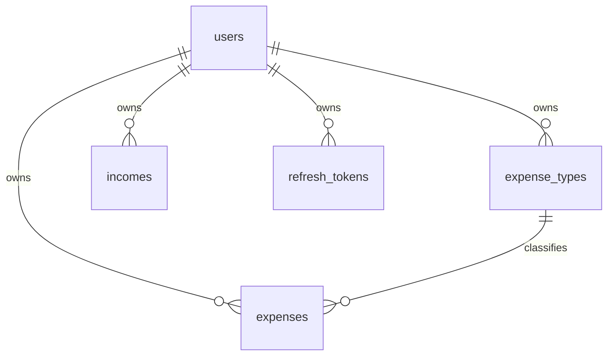
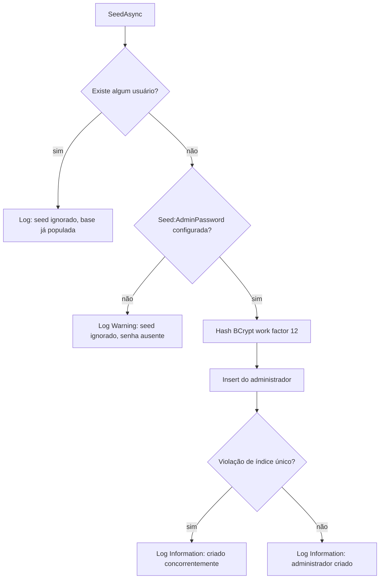

# Design Document

## Overview

Este design cobre a fundação do backend: a solução em quatro camadas, a persistência em PostgreSQL
com as cinco entidades, a migration inicial, o health check, a documentação OpenAPI, o logging
estruturado e o seed condicional do administrador.

Nenhum endpoint de negócio é criado aqui. A borda HTTP se limita a `/health` e `/swagger`, e a
única escrita em banco é o seed. O objetivo é entregar um artefato que compila, sobe, conecta,
responde e já tem credencial para o primeiro login — a base sobre a qual a `mvp-2` acrescenta
autenticação e o CRUD de usuários.

## Architecture

### Estrutura de projetos

```
backend/
├── Paga.sln
├── .gitignore
├── src/
│   ├── Paga.Api/
│   │   ├── Program.cs
│   │   ├── Configuration/ConfigurationValidationExtensions.cs
│   │   ├── appsettings.json
│   │   └── appsettings.Development.json        (não versionado)
│   ├── Paga.Application/
│   │   ├── Abstractions/IPasswordHasher.cs
│   │   └── Abstractions/IDatabaseSeeder.cs
│   ├── Paga.Domain/
│   │   ├── Entities/User.cs
│   │   ├── Entities/ExpenseType.cs
│   │   ├── Entities/Income.cs
│   │   ├── Entities/Expense.cs
│   │   ├── Entities/RefreshToken.cs
│   │   └── Enums/RecurrenceFrequency.cs
│   └── Paga.Infrastructure/
│       ├── Persistence/PagaDbContext.cs
│       ├── Persistence/Configurations/*.cs      (uma por entidade)
│       ├── Persistence/Converters/RecurrenceFrequencyConverter.cs
│       ├── Persistence/Seeding/DatabaseSeeder.cs
│       ├── Persistence/Seeding/SeedOptions.cs
│       ├── Security/BcryptPasswordHasher.cs
│       ├── DependencyInjection.cs
│       └── Migrations/                          (gerada por dotnet ef)
└── tests/
    └── Paga.Tests/
        ├── Unit/
        └── Integration/
```

### Direção das dependências



`Paga.Infrastructure` referencia `Paga.Application` apenas para **implementar** as abstrações
(`IPasswordHasher`, `IDatabaseSeeder`). A regra que importa é a inversa: `Paga.Application` nunca
referencia `Paga.Infrastructure`, e `Paga.Domain` não referencia nada.

`Paga.Api` conhece `Paga.Infrastructure` somente para registrar o DI, via um único ponto de entrada
`AddInfrastructure(configuration)`. Nenhum tipo de EF Core aparece em `Program.cs`.

### Pacotes por projeto

| Projeto | Pacotes |
|---------|---------|
| `Paga.Domain` | nenhum |
| `Paga.Application` | `FluentValidation` |
| `Paga.Infrastructure` | `Microsoft.EntityFrameworkCore`, `Npgsql.EntityFrameworkCore.PostgreSQL`, `EFCore.NamingConventions`, `BCrypt.Net-Next`, `Microsoft.Extensions.Options.ConfigurationExtensions` |
| `Paga.Api` | `Swashbuckle.AspNetCore`, `Serilog.AspNetCore`, `Microsoft.EntityFrameworkCore.Design`, `Microsoft.Extensions.Diagnostics.HealthChecks.EntityFrameworkCore` |
| `Paga.Tests` | `xunit`, `xunit.runner.visualstudio`, `Microsoft.NET.Test.Sdk`, `Microsoft.AspNetCore.Mvc.Testing`, `Testcontainers.PostgreSql`, `FluentAssertions` |

`Microsoft.EntityFrameworkCore.Design` fica em `Paga.Api` porque é o startup project dos comandos
`dotnet ef`.

### Composição do startup

Ordem em `Program.cs`:

1. Bootstrap logger do Serilog, para que falha de configuração já saia logada.
2. `builder.Host.UseSerilog(...)` lendo a configuração de `Serilog`.
3. **Validação de configuração fail-fast:** lê `ConnectionStrings:Default`; se ausente ou vazia,
   lança exceção com mensagem explícita e o processo encerra.
4. `builder.Services.AddInfrastructure(builder.Configuration)` — registra `PagaDbContext` com
   Npgsql e `UseSnakeCaseNamingConvention()`, `IPasswordHasher`, `IDatabaseSeeder` e
   `SeedOptions` vinculado à seção `Seed`.
5. `AddHealthChecks().AddDbContextCheck<PagaDbContext>()`.
6. `AddEndpointsApiExplorer()` e `AddSwaggerGen(...)` com inclusão do XML de documentação.
7. `AddProblemDetails()` — a infraestrutura de erro fica pronta; o handler global de exceções de
   domínio entra na `mvp-2`, junto dos primeiros endpoints.
8. Build, então `UseSerilogRequestLogging()`, Swagger apenas em Development,
   `MapHealthChecks("/health")`.
9. Execução do seed em escopo próprio, antes de `app.Run()`.

## Components and Interfaces

### Paga.Domain

Entidades POCO, sem atributo algum de EF Core, com setters `private`/`init` onde couber e
construtor que exige os campos obrigatórios. `RecurrenceFrequency` é o enum de recorrência:

```csharp
public enum RecurrenceFrequency
{
    Weekly = 1,
    Monthly = 2,
    Yearly = 3
}
```

### Paga.Application

```csharp
public interface IPasswordHasher
{
    string Hash(string password);
    bool Verify(string password, string passwordHash);
}

public interface IDatabaseSeeder
{
    Task SeedAsync(CancellationToken cancellationToken = default);
}
```

`Verify` já entra aqui porque a `mvp-2` vai consumi-lo no login, e manter a abstração completa
evita alterar a interface na spec seguinte.

### Paga.Infrastructure

| Tipo | Responsabilidade |
|------|------------------|
| `PagaDbContext` | Cinco `DbSet<T>`; `OnModelCreating` contém apenas `ApplyConfigurationsFromAssembly` |
| `UserConfiguration` e as outras quatro | Mapeamento por entidade: chaves, tamanhos, precisão, índices, FKs |
| `RecurrenceFrequencyConverter` | `ValueConverter<RecurrenceFrequency?, string?>` para `weekly`/`monthly`/`yearly` |
| `BcryptPasswordHasher` | `IPasswordHasher` com BCrypt, work factor 12 |
| `SeedOptions` | `AdminEmail` e `AdminPassword`, vinculados à seção `Seed` |
| `DatabaseSeeder` | `IDatabaseSeeder` com a lógica condicional e idempotente do administrador |
| `DependencyInjection` | `AddInfrastructure(IConfiguration)`, único ponto de registro |

### Paga.Api

`Program.cs` monta o pipeline. `/health` é mapeado por `MapHealthChecks` com o writer default, que
retorna apenas o texto do status — sem detalhe de infraestrutura no corpo. Swagger é registrado
sempre, mas o middleware da UI só é ativado em Development.

## Data Models

### Diagrama



### users

| Coluna | Tipo | Restrições |
|--------|------|------------|
| `id` | `uuid` | PK, gerado na aplicação |
| `name` | `varchar(200)` | NOT NULL |
| `email` | `varchar(256)` | NOT NULL, índice único |
| `password_hash` | `varchar(100)` | NOT NULL |
| `created_at` | `timestamptz` | NOT NULL, UTC |

### expense_types

| Coluna | Tipo | Restrições |
|--------|------|------------|
| `id` | `integer` | PK, identity |
| `user_id` | `uuid` | NOT NULL, FK → `users.id`, Cascade |
| `name` | `varchar(100)` | NOT NULL |

Índice único composto em `(user_id, name)`.

### incomes

| Coluna | Tipo | Restrições |
|--------|------|------------|
| `id` | `integer` | PK, identity |
| `user_id` | `uuid` | NOT NULL, FK → `users.id`, Cascade |
| `date` | `date` | NOT NULL |
| `description` | `varchar(300)` | NOT NULL |
| `value` | `numeric(18,2)` | NOT NULL |
| `is_recurring` | `boolean` | NOT NULL, default `false` |
| `frequency` | `varchar(10)` | NULL |

Índice em `(user_id, date)` para os filtros de período da `mvp` seguinte de receitas.

### expenses

| Coluna | Tipo | Restrições |
|--------|------|------------|
| `id` | `integer` | PK, identity |
| `user_id` | `uuid` | NOT NULL, FK → `users.id`, Cascade |
| `due_date` | `date` | NOT NULL |
| `description` | `varchar(300)` | NOT NULL |
| `expense_type_id` | `integer` | NOT NULL, FK → `expense_types.id`, Restrict |
| `value` | `numeric(18,2)` | NOT NULL |
| `is_recurring` | `boolean` | NOT NULL, default `false` |
| `frequency` | `varchar(10)` | NULL |

Índice em `(user_id, due_date)`.

### refresh_tokens

| Coluna | Tipo | Restrições |
|--------|------|------------|
| `id` | `uuid` | PK |
| `user_id` | `uuid` | NOT NULL, FK → `users.id`, Cascade |
| `token` | `varchar(200)` | NOT NULL, índice único |
| `expires_at` | `timestamptz` | NOT NULL, UTC |
| `is_revoked` | `boolean` | NOT NULL, default `false` |

### Convenções de mapeamento

- `snake_case` em tabelas, colunas e índices via `UseSnakeCaseNamingConvention()`, sem renomear
  nada à mão nas configurações.
- `Date` e `DueDate` usam `DateOnly` no domínio e `date` no banco. `CreatedAt` e `ExpiresAt` usam
  `DateTime` em UTC e `timestamptz`.
- `Value` é `decimal` com `HasPrecision(18, 2)`.
- `Frequency` é persistido como texto minúsculo pelo converter, nunca como inteiro, para que o
  valor no banco seja igual ao do contrato de API.

## Seeding do administrador

Fluxo de `DatabaseSeeder.SeedAsync`:



Decisões:

- **Seed em runtime, não `HasData`.** A senha vem de configuração (Parameter Store em produção),
  então não pode ser materializada dentro de uma migration versionada.
- **Idempotência por índice único.** Além da checagem `AnyAsync`, o insert captura
  `DbUpdateException` de violação de unicidade em `email` e trata como sucesso. Cobre duas
  instâncias subindo ao mesmo tempo.
- **Sem senha default.** Ausência de `Seed:AdminPassword` gera aviso e nenhum usuário. Uma senha
  fixa em código viraria credencial pública no GitHub.
- **O seed não aplica migrations.** Schema é responsabilidade do `dotnet ef` no local e do script
  SQL idempotente no deploy, conforme `.kiro/steering/infra-aws.md`.
- `AdminEmail` tem default `palaia@increvasenocanal.com` em `appsettings.json`, porque email não é
  segredo. `AdminPassword` não tem default em arquivo algum versionado.

## Configuration

`appsettings.json` versionado, apenas com estrutura e valores não sensíveis:

```json
{
  "ConnectionStrings": { "Default": "" },
  "Seed": { "AdminEmail": "palaia@increvasenocanal.com" },
  "Serilog": { "MinimumLevel": { "Default": "Information" } }
}
```

Sobrescrita local em `appsettings.Development.json` (no `.gitignore`) ou por variável de ambiente,
usando o separador de dois underscores: `ConnectionStrings__Default`, `Seed__AdminPassword`.

Em produção os valores vêm do Parameter Store e são injetados como variável de ambiente pelo
processo de deploy — tratado na `mvp-5`.

## Error Handling

| Situação | Comportamento |
|----------|---------------|
| Connection string ausente na inicialização | Exceção com mensagem explícita, processo encerra antes de aceitar tráfego |
| Banco inacessível em runtime | `/health` responde 503 pelo `DbContextCheck`; corpo sem detalhe de infraestrutura |
| Senha do seed ausente | Log de Warning, nenhum usuário criado, aplicação sobe normalmente |
| Falha inesperada no seed | Log de Error com a exceção; a aplicação continua subindo, e `/health` permanece a fonte de verdade sobre o estado do banco |
| Violação de unicidade no seed | Log de Information, tratado como sucesso |

O handler global que converte exceção de domínio em `ProblemDetails` é responsabilidade da `mvp-2`,
quando existirem endpoints capazes de produzir esses erros. Aqui apenas `AddProblemDetails()` é
registrado.

## Security Considerations

- Senha do administrador nunca em arquivo versionado, nunca em log, hash BCrypt com work factor 12.
- `appsettings.Development.json`, `*.user`, `bin/`, `obj/` e artefatos de publish no `.gitignore`
  desde o primeiro commit, antes de qualquer push para o GitHub público.
- `/health` retorna apenas o status agregado. Não expõe nome de banco, host ou versão.
- Swagger só é servido em Development, para não publicar a superfície da API antes do hardening.
- Nenhuma porta de banco é exposta pela aplicação; a connection string aponta para `localhost` em
  produção.

## Testing Strategy

### Unit (`tests/Paga.Tests/Unit/`)

| Teste | Verifica |
|-------|----------|
| `BcryptPasswordHasherTests` | Hash não é igual à senha, `Verify` aceita a senha correta e rejeita a errada, dois hashes da mesma senha diferem |
| `RecurrenceFrequencyConverterTests` | Conversão nos dois sentidos para `weekly`, `monthly`, `yearly` e para `null` |

### Integration (`tests/Paga.Tests/Integration/`)

Um `PostgresFixture` sobe um container PostgreSQL com `Testcontainers.PostgreSql`, aplica a
migration e expõe a connection string. `PagaApiFactory : WebApplicationFactory<Program>`
sobrescreve `ConnectionStrings:Default` e `Seed:AdminPassword` por teste.

| Teste | Verifica |
|-------|----------|
| `HealthEndpointTests` | `GET /health` responde 200 com banco disponível |
| `MigrationTests` | Migration inicial cria as cinco tabelas, os índices únicos e as FKs em banco limpo |
| `DatabaseSeederTests` | Base vazia com senha configurada cria o administrador com hash BCrypt; base vazia sem senha não cria nada e registra aviso; base já populada não altera nada; execução repetida não duplica |

### Restrições

- Testes de integração usam exclusivamente o container efêmero. A connection string de
  desenvolvimento nunca é lida pela suíte.
- Testcontainers exige Docker. Sem Docker disponível, os testes de integração devem falhar com
  mensagem explícita ou ser explicitamente ignorados — nunca cair em fallback para outro banco.
- O cenário de `/health` retornando 503 não é coberto por teste automatizado nesta spec: derrubar o
  container no meio da execução deixa o teste instável. A verificação é manual, parando o
  PostgreSQL local e conferindo o status.

## Correctness Properties

Invariantes que devem valer independentemente do caminho de execução. Servem de critério de revisão
e de base para os testes.

### Property 1: Pureza do domínio

`Paga.Domain` não tem nenhuma referência de pacote nem nenhum tipo, atributo ou anotação do EF Core.
Verificável por inspeção do `.csproj` e dos `using`.

**Validates: Requirements 1.3, 6.7**

### Property 2: Aciclicidade das camadas

Não existe caminho de referência de `Paga.Application` para `Paga.Infrastructure`, nem de
`Paga.Domain` para qualquer outro projeto da solução.

**Validates: Requirements 1.2, 1.4**

### Property 3: Idempotência do seed

Para qualquer número N ≥ 1 de execuções do seeder, sequenciais ou concorrentes, o total de
administradores criados é no máximo 1.

**Validates: Requirements 8.7**

### Property 4: Condicionalidade do seed

O seeder escreve no banco se e somente se a contagem de usuários é 0 **e** `Seed:AdminPassword` está
preenchida. Em qualquer outro caso o banco permanece inalterado.

**Validates: Requirements 8.1, 8.3, 8.6**

### Property 5: Ausência de segredo versionado

Nenhum arquivo sob controle de versão contém senha, chave criptográfica ou connection string com
valor real e não vazio.

**Validates: Requirements 4.3, 4.4**

### Property 6: Round-trip da recorrência

Para todo valor de `RecurrenceFrequency`, converter para texto e de volta devolve o valor original;
`null` converte para `null` nos dois sentidos; e o texto persistido pertence exatamente ao conjunto
`{weekly, monthly, yearly}`.

**Validates: Requirements 6.6, 7.5**

### Property 7: Consistência do hash

Para toda senha `p`, `Verify(p, Hash(p))` é verdadeiro; para toda senha `q` diferente de `p`,
`Verify(q, Hash(p))` é falso; e `Hash(p)` nunca é igual a `p`.

**Validates: Requirements 8.5**

### Property 8: Honestidade do health check

`GET /health` responde 200 se e somente se o `DbContext` consegue conectar. Caso contrário responde
503.

**Validates: Requirements 2.2, 2.3**

### Property 9: Completude do schema

Aplicar a migration inicial em um banco sem schema produz exatamente as cinco tabelas, os três
índices únicos e os comportamentos de exclusão declarados em Data Models.

**Validates: Requirements 7.6, 7.7, 7.8, 7.10**

### Property 10: Fail-fast de configuração

Com `ConnectionStrings:Default` ausente ou vazia, o processo encerra antes de aceitar qualquer
requisição HTTP.

**Validates: Requirements 4.5**

### Property 11: Isolamento da suíte

Nenhum teste da suíte abre conexão com banco que não seja o container efêmero criado pela própria
execução.

**Validates: Requirements 9.6**

## Requirements Traceability

| Requisito | Onde é atendido |
|-----------|-----------------|
| 1 — Estrutura e camadas | Estrutura de projetos, direção das dependências, pacotes por projeto |
| 2 — Execução e health check | Composição do startup, `Paga.Api`, Error Handling |
| 3 — OpenAPI | Composição do startup itens 6 e 8 |
| 4 — Configuração e segredos | Configuration, Security Considerations |
| 5 — Logging | Composição do startup itens 1, 2 e 8; Error Handling |
| 6 — Modelo de domínio | `Paga.Domain`, Data Models |
| 7 — Persistência e migration | Data Models, Convenções de mapeamento, `Paga.Infrastructure` |
| 8 — Seed do administrador | Seeding do administrador |
| 9 — Testes | Testing Strategy |
