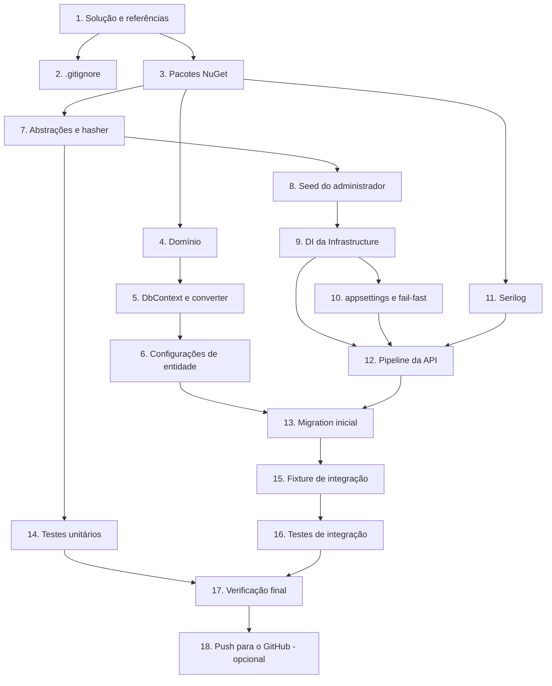

# Implementation Plan

## Overview

18 tarefas que entregam a fundação do backend: solução em camadas, modelo de domínio, persistência
com migration inicial, health check, Swagger, logging e seed do administrador. A tarefa 18 é
opcional e depende de confirmação explícita do usuário.

Sequência em ondas, onde tarefas da mesma onda são independentes entre si:

| Onda | Tarefas |
|------|---------|
| 1 | 1 |
| 2 | 2, 3 |
| 3 | 4, 7, 11 |
| 4 | 5, 8, 14 |
| 5 | 6, 9 |
| 6 | 10 |
| 7 | 12 |
| 8 | 13 |
| 9 | 15 |
| 10 | 16 |
| 11 | 17 |
| 12 | 18 (opcional) |

## Task Dependency Graph



```json
{
  "waves": [
    { "wave": 1, "tasks": ["1"] },
    { "wave": 2, "tasks": ["2", "3"] },
    { "wave": 3, "tasks": ["4", "7", "11"] },
    { "wave": 4, "tasks": ["5", "8", "14"] },
    { "wave": 5, "tasks": ["6", "9"] },
    { "wave": 6, "tasks": ["10"] },
    { "wave": 7, "tasks": ["12"] },
    { "wave": 8, "tasks": ["13"] },
    { "wave": 9, "tasks": ["15"] },
    { "wave": 10, "tasks": ["16"] },
    { "wave": 11, "tasks": ["17"] },
    { "wave": 12, "tasks": ["18"] }
  ],
  "dependencies": {
    "1": [],
    "2": ["1"],
    "3": ["1"],
    "4": ["3"],
    "5": ["4"],
    "6": ["5"],
    "7": ["3"],
    "8": ["7"],
    "9": ["8"],
    "10": ["9"],
    "11": ["3"],
    "12": ["9", "10", "11"],
    "13": ["6", "12"],
    "14": ["7"],
    "15": ["13"],
    "16": ["15"],
    "17": ["14", "16"],
    "18": ["17"]
  }
}
```

## Tasks

- [x] 1. Criar o esqueleto da solução e as referências entre projetos
  - Criar `backend/Paga.sln` e os projetos `src/Paga.Api` (webapi), `src/Paga.Application` (classlib), `src/Paga.Domain` (classlib), `src/Paga.Infrastructure` (classlib) e `tests/Paga.Tests` (xunit), todos em `net10.0`
  - Habilitar `<Nullable>enable</Nullable>` e `<TreatWarningsAsErrors>true</TreatWarningsAsErrors>` em todos os projetos
  - Declarar as referências: `Api → Application`, `Api → Infrastructure`, `Application → Domain`, `Infrastructure → Domain`, `Infrastructure → Application`, `Tests → Api`
  - Confirmar que `Paga.Domain` não tem nenhuma referência e que `Paga.Application` não referencia `Paga.Infrastructure`
  - _Requirements: 1.1, 1.2, 1.3, 1.4, 1.5_

- [x] 2. Criar o `.gitignore` e proteger os arquivos sensíveis
  - Ignorar `bin/`, `obj/`, `*.user`, artefatos de publish, `appsettings.Development.json` e `.env`
  - Criar `appsettings.Development.json` local a partir do `appsettings.json`, apenas na máquina, sem versionar
  - _Requirements: 4.3, 4.4_

- [x] 3. Adicionar os pacotes NuGet de cada projeto
  - `Paga.Application`: `FluentValidation`
  - `Paga.Infrastructure`: `Microsoft.EntityFrameworkCore`, `Npgsql.EntityFrameworkCore.PostgreSQL`, `EFCore.NamingConventions`, `BCrypt.Net-Next`, `Microsoft.Extensions.Options.ConfigurationExtensions`
  - `Paga.Api`: `Swashbuckle.AspNetCore`, `Serilog.AspNetCore`, `Microsoft.EntityFrameworkCore.Design`, `Microsoft.Extensions.Diagnostics.HealthChecks.EntityFrameworkCore`
  - `Paga.Tests`: `xunit`, `xunit.runner.visualstudio`, `Microsoft.NET.Test.Sdk`, `Microsoft.AspNetCore.Mvc.Testing`, `Testcontainers.PostgreSql`, `FluentAssertions`
  - Rodar `dotnet build` e confirmar zero erro e zero warning
  - _Requirements: 1.6_

- [x] 4. Implementar o modelo de domínio
  - Criar `Enums/RecurrenceFrequency.cs` com `Weekly`, `Monthly` e `Yearly`
  - Criar as entidades `User`, `ExpenseType`, `Income`, `Expense` e `RefreshToken` conforme a seção Data Models do design
  - Usar `DateOnly` em `Date` e `DueDate`, `DateTime` em UTC em `CreatedAt` e `ExpiresAt`, `decimal` em `Value`
  - Não usar atributo, tipo ou `using` de EF Core em nenhum arquivo do projeto
  - _Requirements: 6.1, 6.2, 6.3, 6.4, 6.5, 6.6, 6.7_

- [x] 5. Implementar o `PagaDbContext` e o converter de recorrência
  - Criar `PagaDbContext` com os cinco `DbSet<T>` e `OnModelCreating` contendo apenas `ApplyConfigurationsFromAssembly`
  - Criar `RecurrenceFrequencyConverter` mapeando o enum para `weekly`, `monthly` e `yearly`, e `null` para `null`
  - _Requirements: 7.1, 7.2, 7.5_

- [x] 6. Implementar as cinco configurações de entidade
  - Uma classe `IEntityTypeConfiguration<T>` por entidade, com chaves, tamanhos de coluna e precisão conforme Data Models
  - Índice único em `User.Email`, índice único composto em `ExpenseType(UserId, Name)`, índice único em `RefreshToken.Token`
  - Índices de consulta em `Income(UserId, Date)` e `Expense(UserId, DueDate)`
  - FK de `Expense` para `ExpenseType` com `DeleteBehavior.Restrict`; FKs para `User` com `DeleteBehavior.Cascade`
  - Aplicar o converter em `Income.Frequency` e `Expense.Frequency`
  - _Requirements: 7.1, 7.3, 7.4, 7.5, 7.6, 7.7, 7.8_

- [x] 7. Implementar as abstrações da Application e o hasher de senha
  - Criar `IPasswordHasher` com `Hash` e `Verify`, e `IDatabaseSeeder` com `SeedAsync`
  - Implementar `BcryptPasswordHasher` com work factor 12
  - _Requirements: 8.5_

- [x] 8. Implementar o seed condicional do administrador
  - Criar `SeedOptions` com `AdminEmail` e `AdminPassword`, vinculado à seção `Seed`
  - Implementar `DatabaseSeeder`: não faz nada se já existir usuário; registra Warning e não cria nada se a senha estiver ausente; cria o administrador com hash BCrypt caso contrário
  - Tratar `DbUpdateException` de violação de unicidade em `email` como sucesso, registrando Information
  - Não registrar a senha em log em nenhum caminho
  - Não aplicar migration dentro do seeder
  - _Requirements: 8.1, 8.2, 8.3, 8.4, 8.5, 8.6, 8.7, 5.3, 5.4_

- [x] 9. Criar o ponto único de registro de DI da Infrastructure
  - Implementar `AddInfrastructure(this IServiceCollection, IConfiguration)` registrando `PagaDbContext` com Npgsql e `UseSnakeCaseNamingConvention()`, `IPasswordHasher`, `IDatabaseSeeder` e `SeedOptions`
  - Garantir que nenhum tipo de EF Core seja referenciado em `Program.cs`
  - _Requirements: 1.2, 7.3_

- [x] 10. Configurar `appsettings` e a validação fail-fast
  - Criar `appsettings.json` versionado com `ConnectionStrings:Default` vazia, `Seed:AdminEmail` igual a `palaia@increvasenocanal.com` e a seção `Serilog`
  - Implementar a validação que lança exceção com mensagem explícita quando `ConnectionStrings:Default` estiver ausente ou vazia, antes do `app.Run()`
  - Confirmar que a sobrescrita por variável de ambiente funciona com `ConnectionStrings__Default` e `Seed__AdminPassword`
  - _Requirements: 4.1, 4.2, 4.3, 4.5_

- [x] 11. Configurar Serilog
  - Substituir o logging default por Serilog, com bootstrap logger antes do build e `UseSerilogRequestLogging` no pipeline
  - Usar propriedades nomeadas em todos os eventos de log escritos nesta spec
  - _Requirements: 5.1, 5.2_

- [x] 12. Montar o pipeline da API com health check e Swagger
  - Registrar `AddHealthChecks().AddDbContextCheck<PagaDbContext>()` e mapear `GET /health` sem autenticação, com writer que expõe apenas o status
  - Registrar `AddEndpointsApiExplorer`, `AddSwaggerGen` com o XML de documentação e habilitar a UI em `/swagger` somente em Development
  - Habilitar `GenerateDocumentationFile` no `Paga.Api` sem gerar warning de membro não documentado
  - Registrar `AddProblemDetails`
  - Executar o seeder em escopo próprio antes de `app.Run()`
  - _Requirements: 2.1, 2.2, 2.3, 2.4, 2.5, 3.1, 3.2, 3.3_

- [x] 13. Gerar e aplicar a migration inicial
  - Rodar `dotnet ef migrations add InitialCreate --project src/Paga.Infrastructure --startup-project src/Paga.Api`
  - Revisar a migration gerada: nomes em `snake_case`, `numeric(18,2)` em `value`, `date` em `date` e `due_date`, `timestamptz` em `created_at` e `expires_at`, os três índices únicos e os comportamentos de exclusão
  - Aplicar com `dotnet ef database update` contra o PostgreSQL local e conferir o schema criado
  - _Requirements: 7.9, 7.10_

- [x] 14. Escrever os testes unitários
  - `BcryptPasswordHasherTests`: hash diferente da senha, `Verify` aceita a correta e rejeita a errada, dois hashes da mesma senha diferem
  - `RecurrenceFrequencyConverterTests`: round-trip dos três valores e de `null`, e conferência dos textos persistidos
  - _Requirements: 9.1, 9.2_

- [x] 15. Montar a infraestrutura dos testes de integração
  - Criar `PostgresFixture` com `Testcontainers.PostgreSql`, aplicando a migration e expondo a connection string
  - Criar `PagaApiFactory : WebApplicationFactory<Program>` que sobrescreve `ConnectionStrings:Default` e `Seed:AdminPassword` por teste
  - Garantir que a suíte nunca leia a connection string de desenvolvimento e que a ausência de Docker falhe com mensagem explícita, sem fallback
  - _Requirements: 9.2, 9.6_

- [x] 16. Escrever os testes de integração
  - `HealthEndpointTests`: `GET /health` responde 200 com banco disponível
  - `MigrationTests`: a migration inicial cria as cinco tabelas, os três índices únicos e as FKs em banco limpo
  - `DatabaseSeederTests`: base vazia com senha cria o administrador com hash BCrypt; base vazia sem senha não cria nada; base populada não é alterada; execução repetida não duplica
  - _Requirements: 9.3, 9.4, 9.5_

- [x] 17. Verificação final da spec
  - Rodar `dotnet build` e confirmar zero erro e zero warning
  - Rodar `dotnet test` e confirmar a suíte verde
  - Subir a API manualmente, conferir `GET /health` em 200 e a UI do Swagger em `/swagger`
  - Parar o PostgreSQL local e conferir `GET /health` em 503, depois subir o banco novamente
  - Conferir que nenhum arquivo versionado contém senha ou connection string real
  - Percorrer os Acceptance Criteria das Stories 1.1 e 1.2 do board e marcar os atendidos
  - _Requirements: 1.6, 2.1, 2.2, 2.3, 3.1, 4.3, 9.1_

- [~] 18. (Opcional) Publicar o repositório no GitHub
  - Inicializar o repositório, adicionar o remote `https://github.com/humbertopalaia/paga.git` e fazer o primeiro push para `main`
  - Antes do push, revisar o `git status` e confirmar que `appsettings.Development.json` não está sendo enviado
  - Executar somente com confirmação explícita do usuário
  - _Requirements: 4.3, 4.4_

## Notes

- Os testes de integração exigem **Docker** em execução para o Testcontainers. Sem Docker, as
  tarefas 15 e 16 não podem ser verificadas; nesse caso, registre a limitação em vez de trocar o
  banco de destino.
- O cenário de `/health` retornando 503 é verificado manualmente na tarefa 17, parando o PostgreSQL
  local. Não existe teste automatizado para ele nesta spec.
- Nunca deixe `dotnet run` bloqueando a execução das tarefas. Para verificar o startup, use
  `dotnet build` e `dotnet test`; a subida manual da API na tarefa 17 é feita pelo usuário no
  terminal dele.
- Commits não são criados automaticamente. A tarefa 18 só roda com confirmação explícita, e antes do
  push é obrigatório conferir que nenhum segredo entrou no índice do git.
- Ao concluir a tarefa 17, marque os Acceptance Criteria atendidos nas Stories 1.1 e 1.2 de
  `docs/jira-board.md`.
