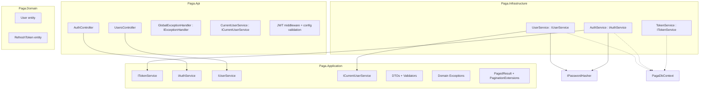
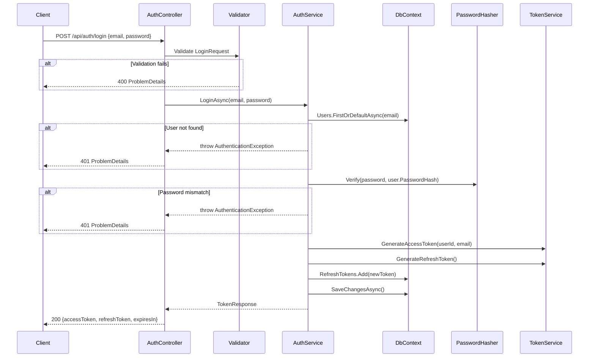
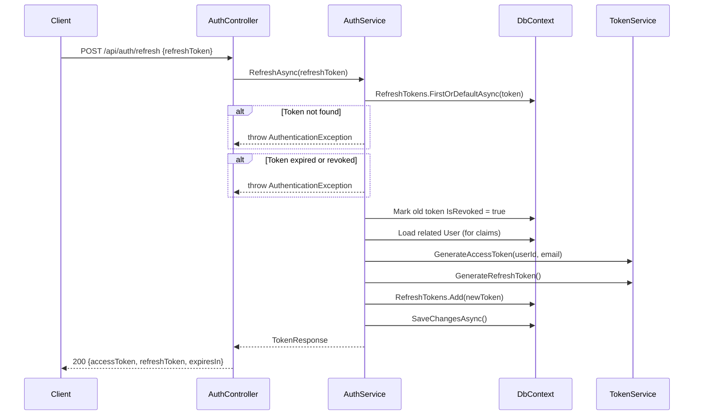

# Design Document

## Overview

Este design cobre a segunda fatia do walking skeleton: autenticação JWT completa (login, refresh
com rotação, logout), CRUD administrativo de usuários, handler global de exceções produzindo
`ProblemDetails`, e o serviço de identidade do usuário corrente.

Constrói sobre a fundação da `mvp-1`: as entidades `User` e `RefreshToken`, o `PagaDbContext`,
`BcryptPasswordHasher` e o seed do administrador já existem. Ao final, o administrador semeado
loga, obtém token, cria novos usuários e gerencia-os. Todos os endpoints passam a exigir
autenticação, exceto login, refresh e health.

## Architecture

### Novos componentes sobre a mvp-1



### Placement decisions

| Componente | Projeto | Motivo |
|------------|---------|--------|
| `ITokenService`, `IAuthService`, `IUserService`, `ICurrentUserService` | Application | Abstrações consumidas por controllers e entre si |
| DTOs, validators, domain exceptions, `PagedResult<T>` | Application | Não dependem de infra |
| `TokenService`, `AuthService`, `UserService` | Infrastructure | Acessam `PagaDbContext` |
| `CurrentUserService` | Api | Precisa de `IHttpContextAccessor` |
| `GlobalExceptionHandler` | Api | Implementa `IExceptionHandler` do ASP.NET Core |
| JWT middleware configuration | Api (`Program.cs`) | Startup pipeline |

### Alterações em Program.cs

Itens adicionados à composição existente (ordem relevante):

1. `builder.Configuration.ValidateJwtKey()` — fail-fast se `Jwt:Key` ausente ou vazia.
2. `builder.Services.AddAuthentication().AddJwtBearer(...)` — HMAC-SHA256, clock skew zero.
3. `builder.Services.AddAuthorization()`.
4. `builder.Services.AddControllers()` — necessário para os controllers.
5. `builder.Services.AddFluentValidationAutoValidation()` + assembly scanning dos validators.
6. `builder.Services.AddExceptionHandler<GlobalExceptionHandler>()`.
7. `builder.Services.AddHttpContextAccessor()`.
8. Registration de `ITokenService`, `IAuthService`, `IUserService`, `ICurrentUserService`.
9. No pipeline: `app.UseExceptionHandler()`, `app.UseAuthentication()`,
   `app.UseAuthorization()`, `app.MapControllers()`.

## Components and Interfaces

### ITokenService

```csharp
namespace Paga.Application.Abstractions;

public interface ITokenService
{
    /// <summary>
    /// Generates an access token (JWT) for the given user.
    /// </summary>
    string GenerateAccessToken(Guid userId, string email);

    /// <summary>
    /// Generates a cryptographically secure opaque refresh token string.
    /// </summary>
    string GenerateRefreshToken();
}
```

Implementação em `Paga.Infrastructure.Security.TokenService`:
- Access token: HMAC-SHA256 com chave de `Jwt:Key`, claims `sub` (UserId) e `email`,
  expiração de 30 minutos a partir de `DateTime.UtcNow`.
- Refresh token: 32 bytes de `RandomNumberGenerator`, codificados em Base64Url.

### IAuthService

```csharp
namespace Paga.Application.Abstractions;

public record TokenResponse(string AccessToken, string RefreshToken, int ExpiresIn);

public interface IAuthService
{
    Task<TokenResponse> LoginAsync(string email, string password, CancellationToken ct = default);
    Task<TokenResponse> RefreshAsync(string refreshToken, CancellationToken ct = default);
    Task LogoutAsync(Guid userId, string refreshToken, CancellationToken ct = default);
}
```

Implementação em `Paga.Infrastructure.Services.AuthService`:
- **Login:** busca user por email, verifica senha com `IPasswordHasher.Verify`, gera par de
  tokens, persiste refresh token com `ExpiresAt = UtcNow + 7 days`, retorna `TokenResponse`.
- **Refresh:** busca token no banco, valida `!IsRevoked && ExpiresAt > UtcNow`, revoga o anterior
  (`IsRevoked = true`), gera novo par, persiste novo refresh token, retorna.
- **Logout:** busca token por valor + userId, se encontrado e não revogado marca `IsRevoked = true`;
  se não encontrado ou já revogado, retorna sem erro (idempotente).

### IUserService

```csharp
namespace Paga.Application.Abstractions;

public interface IUserService
{
    Task<PagedResult<UserResponse>> GetAllAsync(UserFilter filter, CancellationToken ct = default);
    Task<UserResponse> GetByIdAsync(Guid id, CancellationToken ct = default);
    Task<UserResponse> CreateAsync(CreateUserRequest dto, CancellationToken ct = default);
    Task<UserResponse> UpdateAsync(Guid id, UpdateUserRequest dto, CancellationToken ct = default);
    Task DeleteAsync(Guid id, CancellationToken ct = default);
}
```

Implementação em `Paga.Infrastructure.Services.UserService`:
- Todas as queries projetam direto para `UserResponse` com `Select` e `AsNoTracking`.
- `CreateAsync`: valida unicidade de email, gera `Guid.NewGuid()` e `DateTime.UtcNow` no servidor,
  hash BCrypt da senha, insere via `DbContext`.
- `UpdateAsync`: busca entidade tracked, atualiza campos, hash novo se password presente.
- `DeleteAsync`: busca entidade, remove (cascade configurado nas FKs).
- Não-encontrado lança `NotFoundException`; email duplicado lança `ConflictException`.

### ICurrentUserService

```csharp
namespace Paga.Application.Abstractions;

public interface ICurrentUserService
{
    Guid UserId { get; }
}
```

Implementação em `Paga.Api.Services.CurrentUserService`:
- Extrai `HttpContext.User.FindFirstValue(ClaimTypes.NameIdentifier)` (claim `sub`).
- Se ausente ou não parseable como Guid, lança `InvalidOperationException`.

## DTOs and Validators

### Auth DTOs

```csharp
public record LoginRequest
{
    public required string Email { get; init; }
    public required string Password { get; init; }
}

public record RefreshRequest
{
    public required string RefreshToken { get; init; }
}

public record LogoutRequest
{
    public required string RefreshToken { get; init; }
}
```

### User DTOs

```csharp
public record CreateUserRequest
{
    public required string Name { get; init; }
    public required string Email { get; init; }
    public required string Password { get; init; }
}

public record UpdateUserRequest
{
    public required string Name { get; init; }
    public required string Email { get; init; }
    public string? Password { get; init; }
}

public record UserResponse(Guid Id, string Name, string Email, DateTime CreatedAt);

public record UserFilter(string? Name, string? Email, int PageNumber = 1, int PageSize = 10);
```

### Pagination

```csharp
public record PagedResult<T>(
    IReadOnlyList<T> Items,
    int PageNumber,
    int PageSize,
    int TotalCount,
    int TotalPages
);
```

Extension method `ToPagedResultAsync<T>` em `IQueryable<T>` que aplica `Skip`/`Take` e
`CountAsync`, retornando `PagedResult<T>`. Limita `pageSize` a 100, normaliza `pageNumber` ≥ 1.

### Validators (FluentValidation)

| Validator | Regras |
|-----------|--------|
| `LoginRequestValidator` | Email não vazio e formato válido, senha não vazia |
| `RefreshRequestValidator` | RefreshToken não vazio |
| `LogoutRequestValidator` | RefreshToken não vazio |
| `CreateUserRequestValidator` | Nome não vazio, email não vazio e formato válido, senha não vazia e mínimo 6 caracteres |
| `UpdateUserRequestValidator` | Nome não vazio, email não vazio e formato válido, senha (quando não null/vazio) mínimo 6 caracteres |

Todas as mensagens de erro em pt-BR:
- `"O campo email é obrigatório."`, `"O email informado não é válido."`,
  `"A senha deve ter no mínimo 6 caracteres."`, `"O campo nome é obrigatório."`, etc.

## Exception Hierarchy

```csharp
namespace Paga.Application.Exceptions;

/// <summary>Base class for domain-level exceptions mapped by the global handler.</summary>
public abstract class DomainException : Exception
{
    protected DomainException(string message) : base(message) { }
}

/// <summary>Entity not found or not accessible by the current user.</summary>
public class NotFoundException : DomainException
{
    public NotFoundException(string message) : base(message) { }
}

/// <summary>Business rule conflict (duplicate email, referenced entity).</summary>
public class ConflictException : DomainException
{
    public ConflictException(string message) : base(message) { }
}

/// <summary>Authentication failure (invalid credentials, expired/revoked token).</summary>
public class AuthenticationException : DomainException
{
    public AuthenticationException(string message) : base(message) { }
}
```

- `NotFoundException` → HTTP 404
- `ConflictException` → HTTP 409
- `AuthenticationException` → HTTP 401

Recurso de outro usuário lança `NotFoundException` (nunca 403), conforme a regra de não vazar
existência.

## Global Exception Handler

Implementa `IExceptionHandler` (ASP.NET Core 8+):

```csharp
namespace Paga.Api.ExceptionHandling;

public class GlobalExceptionHandler : IExceptionHandler
{
    public async ValueTask<bool> TryHandleAsync(
        HttpContext context, Exception exception, CancellationToken ct)
    {
        var (statusCode, title, errors) = exception switch
        {
            ValidationException ve => (400, "Falha de validação", MapValidationErrors(ve)),
            AuthenticationException => (401, "Credenciais inválidas", null),
            NotFoundException => (404, "Recurso não encontrado", null),
            ConflictException => (409, exception.Message, null),
            _ => (500, "Erro interno do servidor", null)
        };

        // Log full exception for 500s, structured for others
        // Write ProblemDetails response
        // Return true (handled)
    }
}
```

Decisões:
- Para FluentValidation: intercepta `ValidationException` (thrown pelo pipeline) e mapeia cada
  `ValidationFailure` para o dicionário `errors` por property name.
- Para 500: loga exceção completa com `_logger.LogError(ex, "...")`, responde com mensagem
  genérica sem stack trace.
- Mensagens de 409 (conflict) vêm da própria exceção e são escritas em pt-BR pelo service.
- Mensagens de 401 são genéricas e fixas, nunca revelando se o email existe.

## JWT Configuration

```csharp
// In Program.cs or extension method
builder.Services.AddAuthentication(JwtBearerDefaults.AuthenticationScheme)
    .AddJwtBearer(options =>
    {
        var key = builder.Configuration["Jwt:Key"]!;
        options.TokenValidationParameters = new TokenValidationParameters
        {
            ValidateIssuer = false,
            ValidateAudience = false,
            ValidateLifetime = true,
            ValidateIssuerSigningKey = true,
            IssuerSigningKey = new SymmetricSecurityKey(Encoding.UTF8.GetBytes(key)),
            ClockSkew = TimeSpan.Zero
        };
    });

builder.Services.AddAuthorization();
```

Decisões:
- **Sem Issuer/Audience:** aplicação single-tenant, sem microserviços, sem OAuth externo.
- **ClockSkew = Zero:** access token curto (30 min), tolerância de clock causaria confusão.
- **Fail-fast:** antes de registrar o JWT, valida que `Jwt:Key` existe e tem pelo menos 32
  caracteres (256 bits para HMAC-SHA256).

`appsettings.json` adiciona:
```json
{
  "Jwt": { "Key": "" },
  "RefreshToken": { "ExpirationDays": 7 }
}
```
Valor real de `Jwt:Key` em `appsettings.Development.json` (gitignored) ou variável de ambiente.

## Pagination Helper

```csharp
namespace Paga.Application.Common;

public static class PaginationExtensions
{
    public static async Task<PagedResult<T>> ToPagedResultAsync<T>(
        this IQueryable<T> query,
        int pageNumber,
        int pageSize,
        CancellationToken ct = default)
    {
        pageNumber = Math.Max(1, pageNumber);
        pageSize = Math.Clamp(pageSize, 1, 100);

        var totalCount = await query.CountAsync(ct);
        var totalPages = (int)Math.Ceiling(totalCount / (double)pageSize);

        var items = await query
            .Skip((pageNumber - 1) * pageSize)
            .Take(pageSize)
            .ToListAsync(ct);

        return new PagedResult<T>(items, pageNumber, pageSize, totalCount, totalPages);
    }
}
```

## Controller Design

### AuthController

```
[ApiController]
[Route("api/auth")]
public class AuthController : ControllerBase
{
    POST /api/auth/login    [AllowAnonymous]  → 200 TokenResponse | 400 | 401
    POST /api/auth/refresh  [AllowAnonymous]  → 200 TokenResponse | 400 | 401
    POST /api/auth/logout   [Authorize]       → 200 | 400 | 401
}
```

- `[Authorize]` aplicado como filtro global nos controllers; login e refresh usam
  `[AllowAnonymous]`.
- Controllers delegam inteiramente ao service. Nenhuma lógica de negócio.
- Login e refresh retornam `Ok(tokenResponse)`.
- Logout retorna `Ok()` (sem corpo).

### UsersController

```
[ApiController]
[Route("api/users")]
[Authorize]
public class UsersController : ControllerBase
{
    GET    /api/users         → 200 PagedResult<UserResponse>
    GET    /api/users/{id}    → 200 UserResponse | 404
    POST   /api/users         → 201 UserResponse | 400 | 409
    PUT    /api/users/{id}    → 200 UserResponse | 400 | 404 | 409
    DELETE /api/users/{id}    → 204 | 404
}
```

- `POST` retorna `CreatedAtAction(nameof(GetById), new { id }, response)`.
- `DELETE` retorna `NoContent()`.
- Todos exigem autenticação (herda do atributo de classe).

## Data Flow Diagrams

### Login Flow



### Refresh Flow



## Data Models

Nenhuma entidade nova. Usa `User` e `RefreshToken` da `mvp-1` sem alteração. A entidade `User`
ganha um setter adicional ou método para permitir atualização de `Name`, `Email` e `PasswordHash`
pelo `UserService`:

```csharp
// Added to User entity
public void Update(string name, string email, string? passwordHash = null)
{
    Name = name;
    Email = email;
    if (passwordHash is not null)
        PasswordHash = passwordHash;
}
```

`RefreshToken` ganha método para revogação:

```csharp
// Added to RefreshToken entity
public void Revoke()
{
    IsRevoked = true;
}
```

Essas mutações mantêm os setters privados e encapsulam a lógica.

## Correctness Properties

*A property is a characteristic or behavior that should hold true across all valid executions of
a system — essentially, a formal statement about what the system should do. Properties serve as
the bridge between human-readable specifications and machine-verifiable correctness guarantees.*

### Property 1: Token claims correctness

*For any* user with a given `Id` and `Email`, when `GenerateAccessToken` is called, the resulting
JWT must contain exactly the claims `sub` = userId.ToString() and `email` = user email, and the
`exp` claim must equal issuance time + 30 minutes.

**Validates: Requirements 1.2, 1.3**

### Property 2: Refresh token entropy and uniqueness

*For any* N invocations of `GenerateRefreshToken()`, all N values must be distinct, and each
must have at least 32 bytes of entropy (Base64Url length ≥ 43 characters).

**Validates: Requirements 3.7**

### Property 3: Login persists valid refresh token

*For any* successful login (valid email + correct password), the system must persist exactly one
new `RefreshToken` record with `IsRevoked = false` and `ExpiresAt` = UtcNow + 7 days.

**Validates: Requirements 2.4**

### Property 4: Refresh rotation revokes predecessor

*For any* successful refresh operation using token T, the record for T must have `IsRevoked = true`
after the operation completes, and a new distinct token T' must be persisted.

**Validates: Requirements 3.2**

### Property 5: Logout idempotence

*For any* refresh token value V and user U, calling logout with V any number of times N ≥ 1
always returns success (HTTP 200), regardless of whether V exists, is already revoked, or belongs
to another user (the last case returns 401 only on first call — but for same user, always 200).

**Validates: Requirements 4.3**

### Property 6: Exception handler information hiding

*For any* unhandled exception of type not in the domain exception hierarchy, the HTTP response
body must be a `ProblemDetails` with status 500 that does not contain the exception message,
stack trace, or any internal infrastructure detail.

**Validates: Requirements 6.1**

### Property 7: Validation exception mapping completeness

*For any* `ValidationException` with N failures across M properties, the resulting `ProblemDetails`
response must have status 400 and the `errors` dictionary must contain exactly M keys, each with
the list of error messages for that property.

**Validates: Requirements 6.3**

### Property 8: Access-denied indistinguishable from not-found

*For any* resource that exists but belongs to user A, a request from user B must receive an HTTP 404
response identical in shape to the response for a genuinely non-existent resource.

**Validates: Requirements 6.6**

### Property 9: User filter correctness

*For any* filter parameters `name` and `email`, every user in the returned `items` must have
a `Name` containing the filter string (case-insensitive) and an `Email` containing the filter
string (case-insensitive). No user matching both filters may be excluded from the result.

**Validates: Requirements 7.2, 7.3**

### Property 10: Pagination envelope consistency

*For any* `pageNumber` and `pageSize`, the response must satisfy:
`items.length <= pageSize`, `totalPages == ceil(totalCount / pageSize)`,
`pageNumber` matches the requested value (clamped to ≥ 1), and `pageSize` matches the requested
value (clamped to 1..100).

**Validates: Requirements 7.4**

### Property 11: No password hash exposure

*For any* endpoint that returns user data (`GET /api/users`, `GET /api/users/{id}`,
`POST /api/users`, `PUT /api/users/{id}`), the response body must never contain a field named
`passwordHash` or any representation of the stored hash.

**Validates: Requirements 7.5, 8.3**

### Property 12: Password hash round-trip on creation

*For any* valid password P supplied in `CreateUserRequest`, after user creation, the stored
`PasswordHash` must satisfy `IPasswordHasher.Verify(P, storedHash) == true`.

**Validates: Requirements 9.2**

### Property 13: Update without password preserves hash

*For any* `UpdateUserRequest` where `Password` is null or empty, the user's `PasswordHash` in the
database must remain byte-for-byte identical before and after the update.

**Validates: Requirements 10.3**

### Property 14: Server-generated identity

*For any* `CreateUserRequest`, regardless of any `id` or `createdAt` values in the HTTP body,
the persisted user must have a server-generated `Id` (new Guid) and `CreatedAt` (UTC timestamp
at creation time), never echoing client-supplied values.

**Validates: Requirements 9.6**

## Error Handling

| Exceção | HTTP Status | Corpo |
|---------|-------------|-------|
| `ValidationException` (FluentValidation) | 400 | `ProblemDetails` com `errors` por propriedade |
| `AuthenticationException` | 401 | `ProblemDetails` com mensagem genérica fixa |
| `NotFoundException` | 404 | `ProblemDetails` com mensagem genérica |
| `ConflictException` | 409 | `ProblemDetails` com mensagem pt-BR descritiva |
| Qualquer outra exceção | 500 | `ProblemDetails` genérico, sem detalhes internos |

Regras:
- Exceção 500 é logada com `LogError` incluindo stack trace completo.
- Exceções de domínio (4xx) são logadas com `LogWarning` sem stack trace.
- Mensagens de validação e conflito em pt-BR, pois são exibidas ao usuário.
- A mensagem de 401 é sempre `"Credenciais inválidas"` — nunca revela se o email existe ou se a
  senha está errada.

## Security Considerations

- **Chave JWT:** mínimo 256 bits (32 caracteres UTF-8). Fail-fast na inicialização se ausente.
  Nunca versionada.
- **Clock skew zero:** evita janela de aceitação de tokens expirados.
- **Refresh token opaco:** 32 bytes de `RandomNumberGenerator.GetBytes`, codificado em Base64Url.
  Não é JWT — não carrega claims legíveis.
- **Rotação de refresh:** ao usar, o anterior é revogado. Impede replay de token roubado após a
  vítima ter feito refresh.
- **Tempo constante na verificação de senha:** `BCrypt.Verify` já opera em tempo constante
  internamente.
- **Mensagem de erro uniforme no login:** `"Credenciais inválidas"` para email inexistente e para
  senha errada — impede enumeração de emails.
- **404 para recurso de outro usuário:** nunca 403, para não confirmar existência.
- **Sem PII em log:** nunca logar senha, hash, token ou email em nível acima de Debug.
- **Refresh token lifetime:** 7 dias. Após expirar, forçar re-login.
- **Cascade delete:** excluir usuário apaga todos os refresh tokens dele, impossibilitando uso
  posterior.

## Testing Strategy

### Abordagem de teste dual

- **Testes unitários:** validam lógica isolada dos services, validators e token generation com
  dependências mockadas. Focam em cenários específicos e edge cases.
- **Testes de integração:** validam o fluxo HTTP end-to-end com banco real (Testcontainers
  PostgreSQL) via `WebApplicationFactory`. Cobrem status codes, shape do JSON, persistência real
  e interações entre componentes.

### Unit Tests (`tests/Paga.Tests/Unit/`)

| Classe de teste | Cenários |
|-----------------|----------|
| `TokenServiceTests` | JWT gerado com claims corretas, expiração 30 min; refresh token com ≥ 43 chars, unicidade em 100 gerações |
| `AuthServiceTests` | Login com credenciais válidas retorna TokenResponse; email inexistente lança AuthenticationException; senha incorreta lança AuthenticationException; refresh com token válido rotaciona; refresh com token expirado lança; refresh com token revogado lança; refresh com token inexistente lança; logout idempotente |
| `UserServiceTests` | Create com email duplicado lança ConflictException; create com dados válidos retorna UserResponse; update com senha atualiza hash; update sem senha preserva hash; update com email de outro lança ConflictException; delete existente remove; delete inexistente lança NotFoundException |
| `CreateUserRequestValidatorTests` | Nome vazio falha; email vazio falha; email formato inválido falha; senha vazia falha; senha < 6 chars falha; todos válidos passa |
| `UpdateUserRequestValidatorTests` | Nome vazio falha; email inválido falha; senha presente < 6 chars falha; senha null passa; todos válidos passa |
| `LoginRequestValidatorTests` | Email vazio falha; senha vazia falha; válido passa |
| `GlobalExceptionHandlerTests` | ValidationException → 400 com errors; NotFoundException → 404; ConflictException → 409; AuthenticationException → 401; Exception genérica → 500 sem stack trace |

### Integration Tests (`tests/Paga.Tests/Integration/`)

Infraestrutura: `PagaApiFactory : WebApplicationFactory<Program>` com Testcontainers PostgreSQL.
Cada classe de teste recebe banco isolado. Helper `AuthenticateAsync()` faz login com o admin
semeado e retorna o `HttpClient` com Bearer token configurado.

| Classe de teste | Cenários |
|-----------------|----------|
| `AuthEndpointsTests` | Login admin semeado → 200 com TokenResponse; login email inexistente → 401; login senha errada → 401; login payload inválido → 400; refresh válido → 200 novo par; refresh token revogado → 401; refresh token expirado → 401; logout revoga token; logout idempotente; endpoints protegidos sem token → 401 |
| `UsersEndpointsTests` | GET /api/users → 200 com envelope; GET com filtro name → filtra; GET com filtro email → filtra; GET /api/users/{id} → 200; GET /api/users/{id} inexistente → 404; POST → 201 com dados; POST email duplicado → 409; POST payload inválido → 400; PUT → 200 atualizado; PUT com senha → hash atualizado; PUT sem senha → hash preservado; PUT email duplicado → 409; PUT inexistente → 404; DELETE → 204; DELETE inexistente → 404; todos sem token → 401 |

### Property-Based Testing

A biblioteca escolhida é **FsCheck** (via `FsCheck.Xunit`), integrada com xUnit.

Propriedades implementadas como PBT com mínimo 100 iterações:

| Propriedade | Teste |
|-------------|-------|
| Property 1 (Claims) | Gera userId e email aleatórios, verifica claims e exp no JWT decodificado |
| Property 2 (Entropy) | Gera 100 refresh tokens, verifica unicidade e comprimento mínimo |
| Property 10 (Pagination) | Gera pageNumber [1..100] e pageSize [1..100], popula N users, verifica envelope |
| Property 12 (Hash round-trip) | Gera senhas aleatórias [6..50 chars], cria user, verifica Verify(password, hash) |
| Property 13 (Preserve hash) | Gera update sem password, verifica hash inalterado |
| Property 14 (Server identity) | Gera Id e CreatedAt no body, verifica que o servidor ignora |

Propriedades 3, 4, 5, 6, 7, 8, 9, 11 são cobertas por testes unitários e de integração com
exemplos concretos, pois dependem de infraestrutura (banco, HTTP pipeline) e o custo de 100
iterações de integração não se justifica.

### Test Configuration

```xml
<!-- Paga.Tests.csproj additional packages -->
<PackageReference Include="FsCheck.Xunit" Version="3.*" />
<PackageReference Include="Moq" Version="4.*" />
```

### Definition of Done

Todos os testes passam com `dotnet test`. Build limpo com `dotnet build` sem warnings.
Cada Acceptance Criterion dos Requirements 1–11 tem pelo menos um teste que o valida.

## Requirements Traceability

| Requisito | Onde é atendido |
|-----------|-----------------|
| 1 — JWT middleware | JWT Configuration, Program.cs changes |
| 2 — Login | IAuthService, AuthController, Login Flow diagram |
| 3 — Refresh token | IAuthService, Refresh Flow diagram |
| 4 — Logout | IAuthService, AuthController |
| 5 — ICurrentUserService | Components and Interfaces |
| 6 — Handler global de exceções | Global Exception Handler, Exception Hierarchy |
| 7 — Listagem de usuários | IUserService, Pagination Helper, UsersController |
| 8 — Consulta por ID | IUserService, UsersController |
| 9 — Criação de usuário | IUserService, DTOs and Validators |
| 10 — Atualização de usuário | IUserService, Data Models (User.Update) |
| 11 — Exclusão de usuário | IUserService, cascade delete |
| 12 — Testes unitários | Testing Strategy (Unit Tests) |
| 13 — Testes de integração | Testing Strategy (Integration Tests) |
